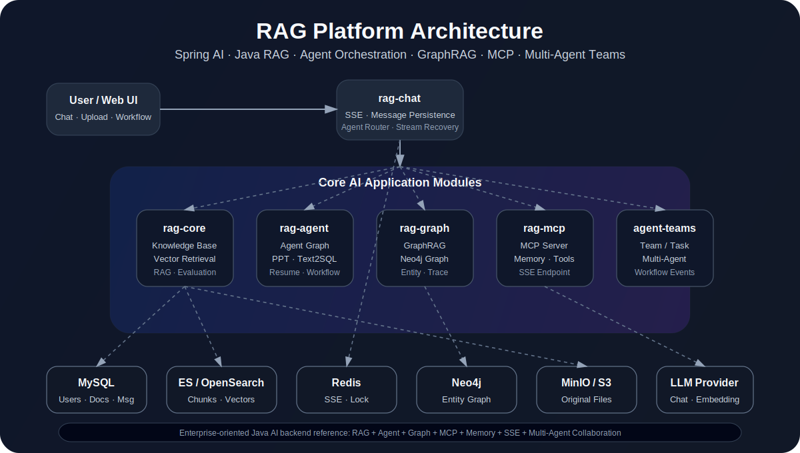

# RAG Platform (Spring AI Multi-Module)

  
  

  

Default language: Chinese. Click the button above to switch.

默认语言：中文。点击上方按钮切换语言。

## Why This Project Matters

`gengzi/rag` is an Apache-2.0 open-source, Spring AI based multi-module RAG and Agent platform for the Java ecosystem.

Many RAG and Agent projects are Python-first or demo-oriented. This repository focuses on enterprise-style Java / Spring backend engineering and provides a modular reference implementation for knowledge ingestion, vector retrieval, SSE streaming chat, message persistence, Agent orchestration, GraphRAG, MCP memory/tool integration, and multi-agent collaboration.

The goal is to help Java backend teams build production-oriented AI applications without starting from scattered demos.

## What This Repo Contains

- Multi-module Spring AI RAG platform
- Knowledge ingestion + vector retrieval + chat memory
- Agent orchestration (DeepResearch / PPT / Excalidraw / Text2SQL)
- Graph-enhanced retrieval (Neo4j)
- MCP server/client integration for tool and memory extension
- Team-style multi-agent collaboration sample

## Read In Order

1. Full Chinese architecture guide: `README.zh-CN.md`
2. English quick architecture guide: `README.en.md`
3. Architecture overview with diagrams: `docs/ARCHITECTURE_OVERVIEW.md`
4. Roadmap: `ROADMAP.md`
5. Contribution guide: `CONTRIBUTING.md`
6. Agent Teams design deep dive: `rag-agent-teams/docs/DESIGN.md`
7. Graph subsystem design deep dive: `rag-graph/docs/SYSTEM_DESIGN.md`

## Module Ports

- `rag-core`: `8883`
- `rag-chat`: `8086`
- `rag-agent`: `8889`
- `rag-graph`: `8199`
- `rag-mcp`: `8890`
- `rag-mcp-client`: `8891`
- `rag-agent-teams`: `8080`
