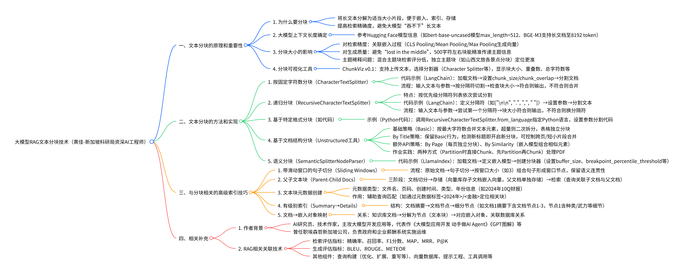

## 大模型RAG文本分块技术（黄佳-新加坡科研局资深AI工程师）
### 一、文本分块的原理和重要性
#### 1. 为什么要分块
- 将长文本分解为适当大小片段，便于嵌入、索引、存储
- 提高检索精确度，避免大模型“吞不下”长文本
#### 2. 大模型上下文长度确定
- 参考Hugging Face模型信息（如bert-base-uncased模型max_length=512、BGE-M3支持长文档至8192 token）
#### 3. 分块大小的影响
- 对检索精度：关联嵌入过程（CLS Pooling/Mean Pooling/Max Pooling生成向量）
- 对生成质量：避免“lost in the middle”，500字符左右块能精准传递主题信息
- 主题稀释问题：混合主题块检索评分低，独立主题块（如山西文旅各景点分块）定位更准
#### 4. 分块可视化工具
- ChunkViz v0.1：支持上传文本，选择分割器（Character Splitter等），显示块大小、重叠数、总字符数等
### 二、文本分块的方法和实现
#### 1. 按固定字符数分块（CharacterTextSplitter）
- 代码示例（LangChain）：加载文档→设置chunk_size/chunk_overlap→分割文档
- 流程：输入文本与参数→按分隔符切割→检查块大小→符合则输出，不符合则合并
#### 2. 递归分块（RecursiveCharacterTextSplitter）
- 特点：按优先级分隔符列表依次尝试分割
- 代码示例（LangChain）：定义分隔符（如["\n\n", ".", ",", " "]）→设置参数→分割文本
- 流程：输入文本与参数→尝试第一个分隔符→块大小符合则输出，不符合则换分隔符
#### 3. 基于特定格式分块（如代码）
- 示例（Python代码）：调用RecursiveCharacterTextSplitter.from_language指定Python语言，设置参数分割代码
#### 4. 基于文档结构分块（Unstructured工具）
- 基础策略（Basic）：按最大字符数合并文本元素，超量则二次拆分，表格独立分块
- By Title策略：保留Basic行为，检测新标题即开启新分块，可控制跨页/短小片段合并
- 额外API策略：By Page（每页独立分块）、By Similarity（嵌入模型组合相似元素）
- 作业实践：两种方式（Partition时直接Chunk、先Partition再Chunk）处理PDF
#### 5. 语义分块（SemanticSplitterNodeParser）
- 代码示例（LlamaIndex）：加载文档→定义嵌入模型→创建分块器（设置buffer_size、breakpoint_percentile_threshold等）
### 三、与分块相关的高级索引技巧
#### 1. 带滑动窗口的句子切分（Sliding Windows）
- 流程：原始文档→句子切分→按窗口大小（如3）组合句子形成窗口节点，保留语义连贯性
#### 2. 父子文本块（Parent-Child Docs）
- 三阶段：文档切分→存储（向量库存子文档嵌入向量，父文档单独存储）→检索（查询关联子文档与父文档）
#### 3. 文本块元数据创建
- 元数据类型：文件名、页码、创建时间、类型、年份信息（如2024年10Q财报）
- 作用：辅助查询匹配（如通过元数据标签<2024年>/<金融>定位相关块）
#### 4. 有级别索引（Summary→Details）
- 结构：文档摘要→文档节点→细分节点（如文档1摘要下含文档节点1-3，节点1含种类/武力等细节）
#### 5. 文档→嵌入对象映射
- 关系：知识库文档→分解为节点（文本块）→对应嵌入对象，关联数据库关系
### 四、相关补充
#### 1. 作者背景
- AI研究员、技术作家，主攻大模型开发应用等，代表作《大模型应用开发 动手做AI Agent》《GPT图解》等
- 曾任职埃森哲新加坡公司，负责政府和企业薪酬系统实施运维
#### 2. RAG相关关联技术
- 检索评估指标：精确率、召回率、F1分数、MAP、MRR、P@K
- 生成评估指标：BLEU、ROUGE、METEOR
- 其他组件：查询构建（优化、扩展、重写等）、向量数据库、提示工程、工具调用等

## 分块大小的衡量
分块大小对检索精度的“损失程度”没有**固定数值**，而是取决于**分块策略、文档类型、任务场景**等多重因素，核心是“语义完整性”与“检索精确性”的权衡：

### 1. 分块过小的精度损失逻辑
- **表现**：分块尺寸远小于合理范围（如＜256 token、＜200字）时，会**割裂上下文逻辑**。
  例如技术文档中一个完整的“问题-解决方案”段落被拆成多块，每块仅包含局部信息，检索时可能因缺少上下文关联，导致“相关文档漏检”（召回率下降）。
- **场景影响**：在需要长程语义（如论文论证、法律条款逻辑）的任务中，小分块的“精度损失”更明显，表现为“关键信息碎片化，无法被整体检索到”。

### 2. 分块过大的精度损失逻辑
- **表现**：分块尺寸远大于合理范围（如＞1024 token、＞1000字）时，会**稀释关键语义**。
  例如一篇包含多个知识点的长文档被整合成大块，用户查询某一具体知识点时，块内大量无关信息会“淹没”关键语义，导致向量表示与查询的相似度计算不准确（精确率下降）。
- **场景影响**：在需要精准匹配（如短文本问答、舆情关键词检索）的任务中，大分块的“精度损失”更突出，表现为“噪音干扰，检索结果相关性降低”。

### 3. 减少精度损失的关键策略（结合参考内容）
- **选对分块范围**：
    - 通用文档（如新闻、问答对）：推荐 **256-512 token（或200-500字）**，平衡语义聚焦与上下文完整性。
    - 专业文档（如技术手册、论文）：推荐 **1024-2048 token（或1000-2000字）**，保留长程逻辑链。
- **优化分块策略**：
    - 增加**重叠度**（分块大小的10%-20%）：避免“语义断裂”，如500字分块设50-100字重叠，让相邻块共享上下文。
    - 采用**语义/结构分块**：而非单纯固定长度。比如基于段落边界、句子相似度（余弦相似度骤降处切分）或文档结构（标题、章节）切分，让每个块保持“完整语义单元”。
- **配合模型与评估**：
    - 选择更优**嵌入模型**（如`all-MiniLM-L6-v2`）：提升语义向量质量，减少分块带来的“语义表达损失”。
    - 用检索指标（如MRR、NDCG）**量化调优**：通过实验对比不同分块下的精度变化，针对性优化。

简言之，分块大小的“精度损失”是**“过碎”或“过粗”导致的语义失衡**，需结合场景灵活调整分块策略，才能将损失降到最低。

## 池化技术
以下是 Embedding 任务中 **4种核心 Pooling 技术** 的简要梳理，聚焦“核心逻辑+优劣势+适用场景”，方便快速对应需求：

### 1. Mean Pooling（平均池化）
- **核心逻辑**：对文本中所有「有效 Token 向量」（排除 Padding）取平均值，得到句子级向量。
- **优势**：
    - 通用型强，不依赖模型特殊设计（任何输出 Token 向量的模型都能用）；
    - 能覆盖文本全局语义，避免“单个标记漏信息”。
- **劣势**：
    - 可能稀释关键 Token 的强语义（比如“负面评价”中“差”的权重被其他中性词拉低）；
    - 需遍历所有 Token 计算，比“单标记池化”稍耗资源（短文本可忽略）。
- **适用场景**：语义检索、文本聚类、跨模型兼容（如 BERT/Qwen 结果对齐）。

### 2. CLS Pooling（CLS 标记池化）
- **核心逻辑**：直接取输入文本开头「[CLS] 特殊标记的向量」作为句子表示（依赖 BERT 类双向模型预训练优化）。
- **优势**：
    - 速度快（直接提取单个向量，无需计算）；
    - 适配 BERT 类模型的“分类预训练目标”（如下一句预测），在有监督分类任务（情感分析、意图识别）中易出效果。
- **劣势**：
    - 模型依赖性极强（仅适用于预训练过 [CLS] 的双向模型，如 BERT/RoBERTa；Qwen/LLaMA 等单向模型用不了）；
    - 语义覆盖窄，若关键信息在文本中部/尾部，[CLS] 可能捕捉不全。
- **适用场景**：BERT 类模型的有监督分类任务（需微调）、对速度敏感的分类场景。

### 3. EOS Pooling（EOS 标记池化）
- **核心逻辑**：取输入文本末尾「<|endoftext|> 特殊标记的向量」作为句子表示（适配 Qwen/LLaMA 等单向模型）。
- **优势**：
    - 适配单向模型的“自左向右生成逻辑”，能更好捕捉长文本（如 8192 Token）的完整语义；
    - 速度快（单标记提取），且 Qwen 等模型原生优化过，开箱即用效果好。
- **劣势**：
    - 模型依赖性强（仅适用于有 EOS 标记的单向模型，BERT 类用不了）；
    - 短文本中若 EOS 前是无关词（如标点），可能影响向量质量。
- **适用场景**：Qwen/LLaMA 等单向模型的句向量生成、长文本检索（如代码/论文语义提取）。

### 4. Max Pooling（最大池化）
- **核心逻辑**：对所有有效 Token 向量的「每个维度取最大值」，突出“最显著的局部特征”。
- **优势**：
    - 能强化文本中的“强语义 Token”（如“诈骗”“安全漏洞”等关键词）；
    - 计算速度比 Mean 快（无需求和再平均，仅取最大值）。
- **劣势**：
    - 信息丢失多（仅保留各维度最大值，忽略其他 Token 的上下文关联）；
    - 稳定性差，若文本中存在极端值 Token（如特殊符号），易干扰结果。
- **适用场景**：需精准捕捉关键词的任务（如舆情关键词匹配、短文本关键词检索）。

### 核心总结：怎么选？
1. **看模型类型**：
    - 单向模型（Qwen/LLaMA）→ 优先 EOS；
    - 双向模型（BERT）→ 分类用 CLS，通用用 Mean。
2. **看任务需求**：
    - 语义完整（检索/聚类）→ Mean；
    - 分类/速度 → CLS/EOS；
    - 抓关键词 → Max。
3. **看资源限制**：
    - 低资源/快速度 → CLS/EOS；
    - 允许稍多计算 → Mean。

## Spring ai 的文本分割器
1. 它使用 CL100K_BASE 编码将输入文本编码为标记。

2. 它根据将编码文本拆分成块defaultChunkSize。

3. 对于每个块：
 * 它将块解码回文本。
 * 它尝试在 之后找到合适的断点（句号、问号、感叹号或换行符）minChunkSizeChars。
 * 如果发现断点，它会截断该点处的块。
 * 它会修剪块并根据设置选择性地删除换行符keepSeparator。
 * 如果结果块长于minChunkLengthToEmbed，则将其添加到输出中。 
4. 此过程持续进行，直到所有令牌都被处理或maxNumChunks达到。
5. 如果剩余文本的长度超过，则会将其添加为最终块minChunkLengthToEmbed。