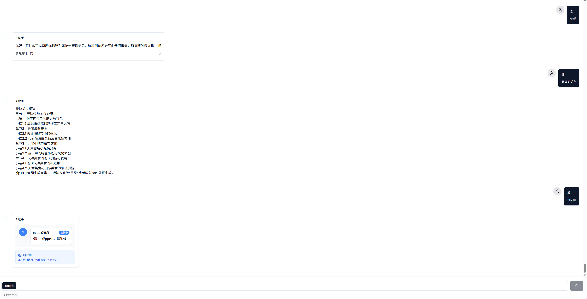

### 普通聊天与agent交互对话记忆的处理

#### 问题
用户在与大模型交互对话时，存在聊天对话历史，可能就包含了普通的对话（闲聊），与某个特定任务的agent（或者react agent）的交互对话内容。
会出现几个问题：
1. 聊天记忆应该怎么存储（那些该存，那些不该存）或者说怎么存才能让llm更好理解之前的对话信息？

2. 针对agent 任务执行时，那些节点需要聊天记忆，那些节点不需要（比如：比较独立的节点）

   如下图：有普通聊天，和ppt agent 的执行，那些信息我们需要存，那些信息不该存。或者都存？

   ppt大纲内容的生成，是否需要之前的聊天对话信息。ppt 生成节点是否需要之前的聊天对话信息

   

   

### 一些想法

##### 简单粗暴

都存储，将聊天记录都变成对话记忆,比如使用滑动窗口，取20条的之前的对话内容。作为后续调用llm的对话记忆

##### 选择存储

针对闲聊我们还是要保留。针对agent 是不是中间节点（不输出重要信息的节点）就不存储

### 方式1：

**任务隔离 + 上下文显式重置**

不要依赖模型“自动理解”当前是新任务。而是**主动声明任务边界**。

**做法示例**：

> “从现在开始，请忽略之前的对话内容。我们将开始一个全新的PPT大纲生成任务。请仅根据以下要求输出：……”

或者在特定节点就不要使用聊天记忆

### 方式2

 **上下文裁剪（Context Truncation / Sliding Window）**

在多轮交互中，**只保留与当前步骤强相关的上下文**，其余丢弃。

通过llm 将聊天记忆 压缩，过滤，针对特定任务提取需要的记忆。其他忽略

### 方式3

**输出后校验 + 自动清洗（Post-processing Guardrails）**

在agent 有些节点，是用来给用户展示流程信息的或者反馈信息，比如 “正在生成中。。。， ” ，“咨询用户有修改意见？”等

这些信息可能是llm输出的或者我们人为添加的。但是这些信息有可能会影响下一次的交互。比如下一次大模型回复时参考了上述记忆，本来不应该返回 正在生成中，也返回了。

所以针对人为添加的提示，可以通过输自动清洗逻辑。比如在人为定义的内容前后，添加上特殊标记（[need_rm_start]   xxxx [need_rm_end]） 的标记，在将聊天记忆入库时，将此本文都移除掉，不添加到数据库中

针对llm生成的内容，可以进行输出后校验。 比如 要求llm 生成的数据都 ## 开头的，发现存在有不是的情况。那就进行校验，后清洗，不符合规则的文本也不进行入库处理。

