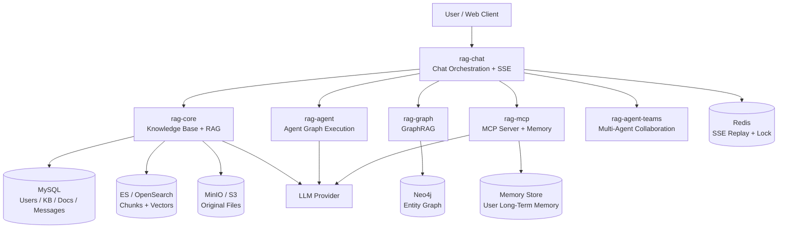
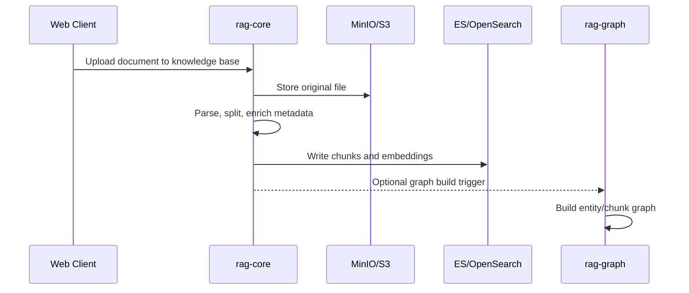
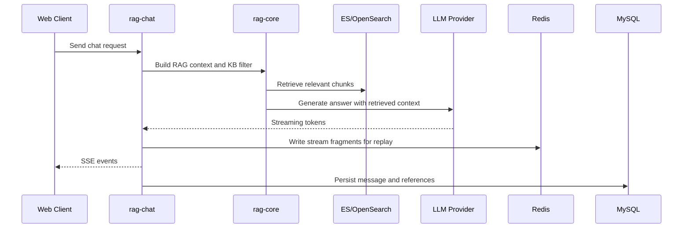
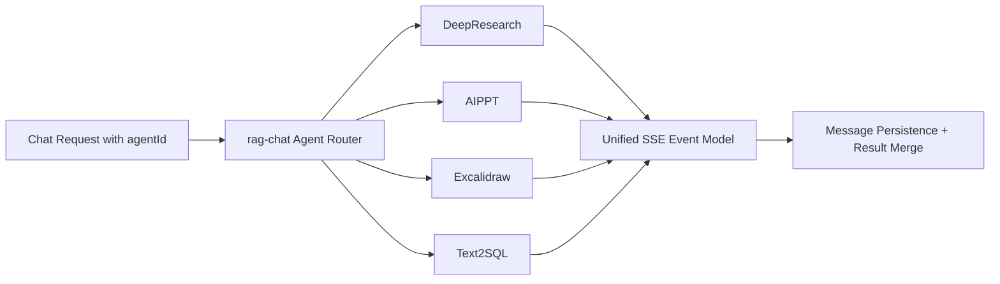
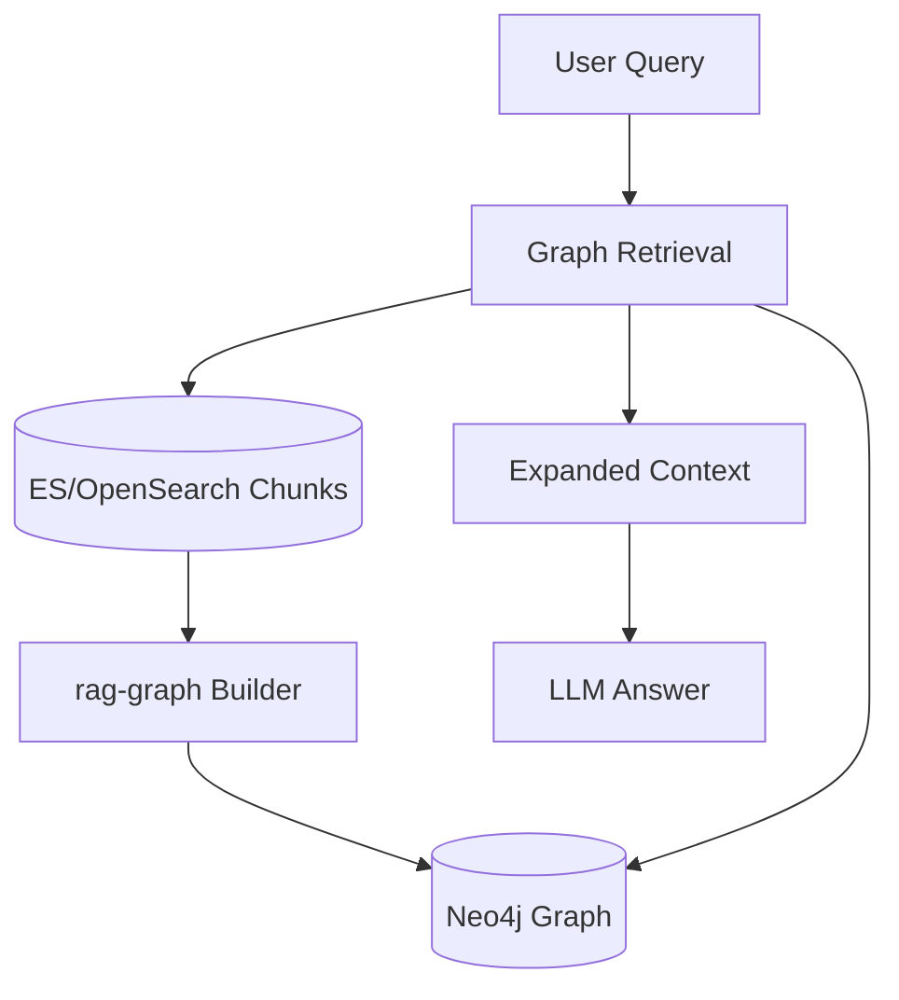
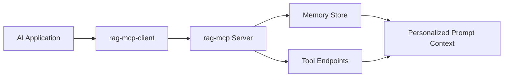

# Architecture Overview

`gengzi/rag` is a multi-module Spring AI based RAG and Agent platform. It is designed as an engineering-oriented reference for Java / Spring teams that want to build enterprise AI applications with retrieval, memory, tools, graph retrieval, streaming output, and multi-agent collaboration.

## Why This Project Matters

Most RAG and Agent examples are Python-first or demo-oriented. This repository focuses on the Java / Spring AI ecosystem and provides a modular backend implementation that is closer to enterprise engineering practices.

The project combines:

- Knowledge ingestion and vector retrieval
- SSE streaming chat
- Conversation persistence and recovery
- Agent routing and graph workflow execution
- GraphRAG with Neo4j
- MCP server/client integration
- Long-term memory service
- Multi-agent team collaboration examples

The goal is not only to show how RAG works, but also to show how a backend team can organize modules, APIs, storage, streaming events, and extension points in a maintainable way.

## High-Level Architecture

## Module Responsibilities

| Module | Responsibility |
|---|---|
| `rag-core` | Core RAG capability layer: knowledge base, document ingestion, chunking, embedding, vector retrieval, RAG chat, evaluation |
| `rag-chat` | Unified chat entry, SSE stream output, Agent routing, message persistence and recovery |
| `rag-agent` | Agent graph execution, AIPPT generation, human feedback resume, PPT template parsing |
| `rag-graph` | ES/OpenSearch to Neo4j graph build, graph retrieval, entity tracing, GraphRAG entry |
| `rag-mcp` | MCP server, user memory storage and retrieval, tool capability exposure |
| `rag-mcp-client` | MCP client integration sample with `ChatClient + ToolCallbacks + MCP` |
| `rag-agent-teams` | Team/Task/Message based multi-agent collaboration sample |
| `rag-serach` | Retrieval and DeepResearch extension module |
| `rag-common` / `rag-dao` / `rag-manager` | Shared models, persistence abstractions, and management extensions |

## Core Flows

### 1. Knowledge Ingestion

### 2. RAG Chat

### 3. Agent Routing

### 4. GraphRAG

### 5. MCP Memory and Tools

## Engineering Principles

- Keep reusable RAG capabilities in `rag-core`.
- Keep high-change scenario orchestration in upper modules.
- Use SSE as the primary interaction model for chat and agent workflows.
- Persist messages and references instead of treating chat as transient text.
- Keep graph structure in Neo4j and vectors in ES/OpenSearch.
- Use MCP to expose memory and tools in a reusable way.
- Prefer module boundaries and extension points over monolithic demo code.

## Production Readiness Work

The current repository is an early-stage engineering baseline. Important production-readiness work is tracked in `ROADMAP.md` and GitHub Issues, including:

- Docker Compose quickstart
- Persistent graph checkpoint saver
- Prompt template versioning
- Integration tests for RAG, SSE, and retrieval isolation
- Metrics and observability
- Improved local configuration examples
