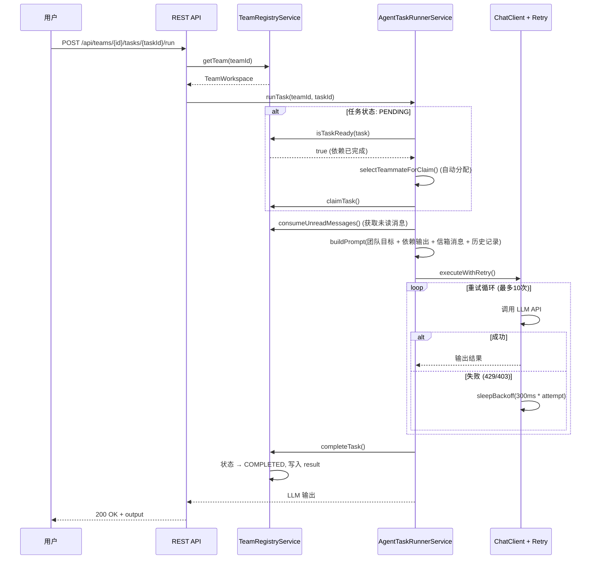
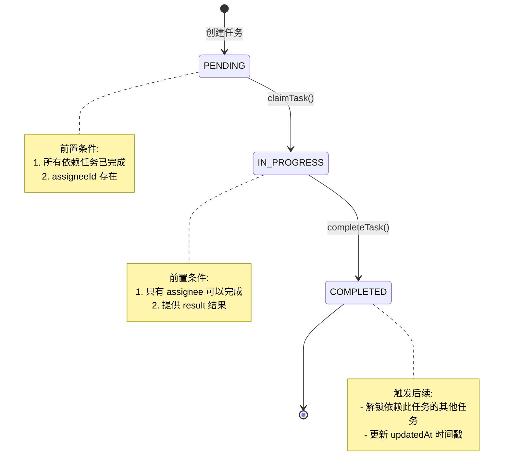
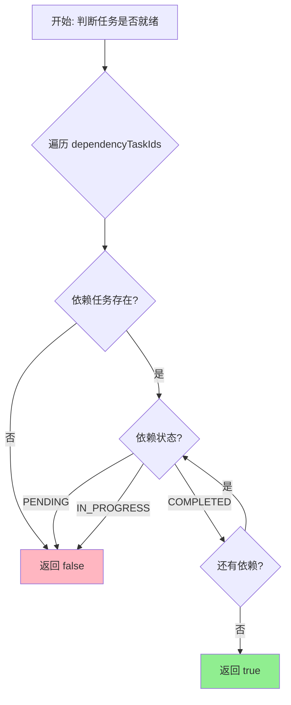
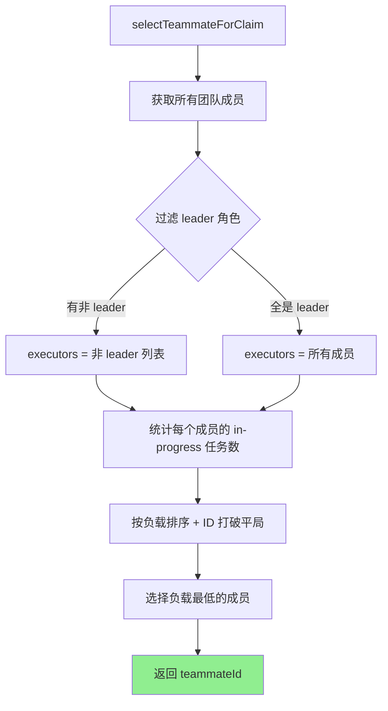
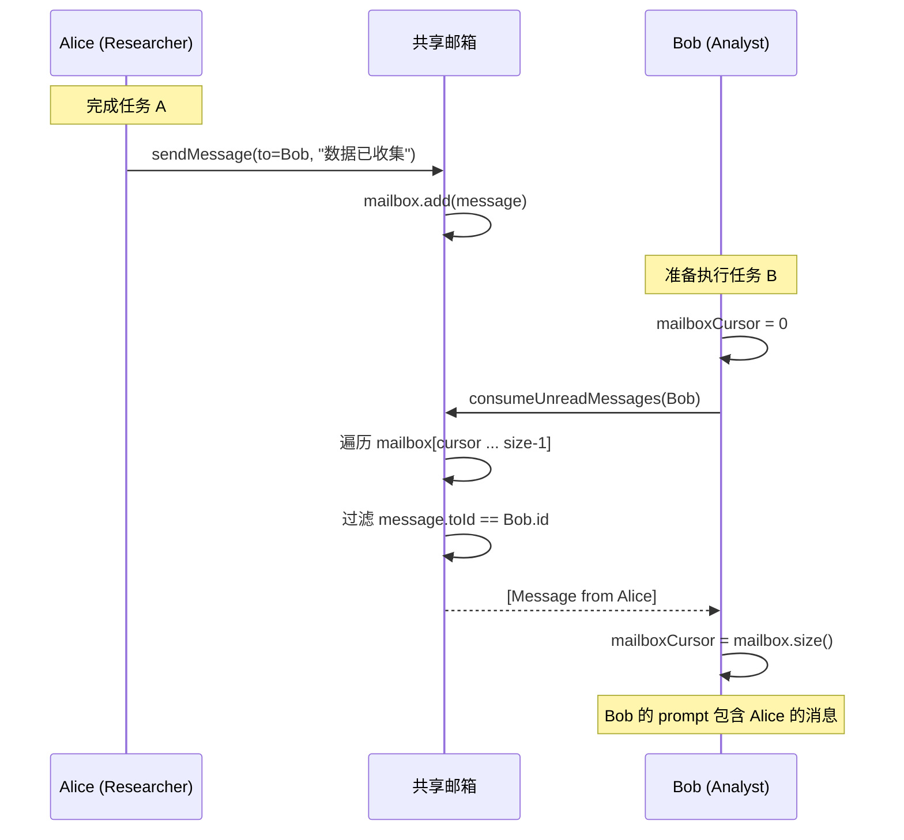
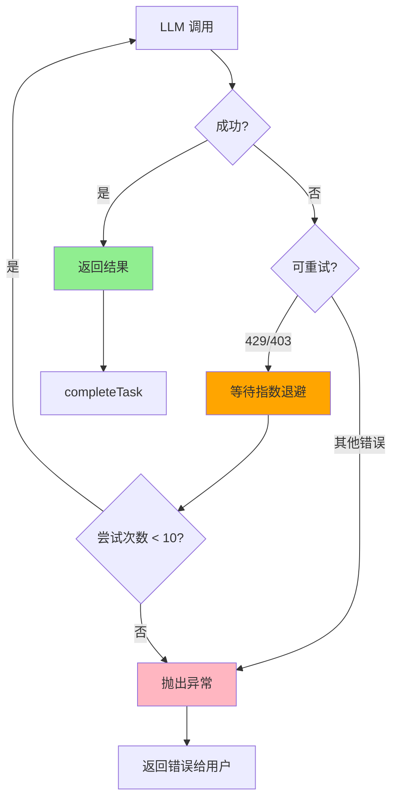

# RAG Agent Teams 架构概览

> 快速了解项目架构的核心设计模式和关键流程

## 📋 目录

- [分层架构](#分层架构)
- [核心领域模型](#核心领域模型)
- [关键流程图](#关键流程图)
- [设计模式](#设计模式)
- [技术栈](#技术栈)

---

## 分层架构

```
┌─────────────────────────────────────────────────────────┐
│                    API Layer (接口层)                    │
│  ┌──────────────────────┐  ┌──────────────────────┐    │
│  │ REST API Controller  │  │ NL API Controller    │    │
│  │ - AgentTeamsController│  │ - NaturalLanguage   │    │
│  │                      │  │   Controller         │    │
│  └──────────────────────┘  └──────────────────────┘    │
└────────────────────────┬────────────────────────────────┘
                         │
┌────────────────────────▼────────────────────────────────┐
│               Service Layer (业务逻辑层)                  │
│  ┌──────────────────┐  ┌──────────────────────────┐     │
│  │ TeamRegistry     │  │ AgentTaskRunnerService  │     │
│  │ - 状态管理        │  │ - 任务执行编排          │     │
│  │ - 并发控制        │  │ - 自动分配              │     │
│  │ - 一致性校验      │  │ - 上下文注入            │     │
│  └──────────────────┘  └──────────────────────────┘     │
│  ┌──────────────────┐                                  │
│  │ LlmRetryService  │                                  │
│  │ - 指数退避重试    │                                  │
│  │ - 智能错误检测    │                                  │
│  └──────────────────┘                                  │
└────────────────────────┬────────────────────────────────┘
                         │
┌────────────────────────▼────────────────────────────────┐
│              Domain Layer (领域模型层)                    │
│  ┌─────────────┐  ┌─────────────┐  ┌──────────────┐   │
│  │TeamWorkspace│  │  TeamTask   │  │TeammateAgent │   │
│  │ 聚合根      │  │  任务实体   │  │  代理实体    │   │
│  └─────────────┘  └─────────────┘  └──────────────┘   │
│  ┌─────────────┐                                       │
│  │ TeamMessage │                                       │
│  │ 值对象      │                                       │
│  └─────────────┘                                       │
└───────────────────────────────────────────────────────┘
```

---

## 核心领域模型

### TeamWorkspace (聚合根)

```java
public class TeamWorkspace {
    private final String id;                          // 团队唯一标识
    private final String name;                        // 团队名称
    private final String objective;                   // 团队目标

    // 聚合内实体
    private final Map<String, TeammateAgent> teammates;  // 成员集合
    private final Map<String, TeamTask> tasks;           // 任务集合
    private final List<TeamMessage> mailbox;            // 共享邮箱

    private final Instant createdAt;
    private long planVersion;                          // 计划版本号（每次计划变更自增）

    // 增加 planVersion 并返回新值
    public long bumpPlanVersion() {
        this.planVersion++;
        return this.planVersion;
    }
}
```

**职责**: 管理整个团队的一致性边界，所有外部操作必须通过它进行。

**关键特性**:
- **计划版本追踪**: `planVersion` 在每次新增/更新/删除任务时自增
- **自动 Leader 创建**: 如果团队缺少 Leader，系统会自动创建

### TeamTask (任务实体)

```java
public class TeamTask {
    private final String id;
    private String title;                      // 可修改
    private String description;                // 可修改
    private final List<String> dependencyTaskIds;  // 可替换

    private TaskStatus status;        // PENDING → IN_PROGRESS → COMPLETED
    private String assigneeId;       // 执行人ID
    private String result;           // 执行结果

    private final Instant createdAt;
    private Instant updatedAt;       // 状态变化时间戳（任何修改都更新）

    // 可修改字段的方法
    public void setTitle(String title) {
        this.title = title;
        this.updatedAt = Instant.now();
    }

    public void setDescription(String description) {
        this.description = description;
        this.updatedAt = Instant.now();
    }

    public void replaceDependencies(List<String> dependencies) {
        this.dependencyTaskIds.clear();
        this.dependencyTaskIds.addAll(dependencies);
        this.updatedAt = Instant.now();
    }
}
```

**职责**: 表示一个可执行的原子工作单元，支持依赖关系、状态转换和动态修改。

**关键特性**:
- **动态修改**: 支持更新标题、描述、依赖关系和执行人
- **时间戳追踪**: 任何修改都会更新 `updatedAt` 时间戳
- **状态约束**: 只有 PENDING 状态的任务可以被修改或删除

### TeammateAgent (代理实体)

```java
public class TeammateAgent {
    private final String id;
    private final String name;              // 显示名称
    private final String role;              // 角色 (Researcher/Analyst/...)
    private final String model;             // 使用的模型
    private final List<String> history;     // 私人记忆 (最近6条)
    private int mailboxCursor;              // 邮箱消费游标
}
```

**职责**: 表示一个具有角色、记忆和消息处理能力的 AI 代理。

### TeamMessage (值对象)

```java
public record TeamMessage(
    String fromId,        // 发送者ID
    String toId,          // 接收者ID
    String content,       // 消息内容
    Instant createdAt     // 发送时间
) {}
```

**职责**: 代理间通信的不可变消息载体（使用 Java Record 保证不可变性）。

---

## 关键流程图

### 1. 任务执行时序图



### 2. 任务依赖状态机



### 3. 依赖解析流程



### 4. 自动分配算法



### 5. 消息传递流程



### 6. LLM 重试策略



**退避时间表**:

| 尝试 | 等待时间 | 累计 |
|-----|---------|------|
| 1   | 300ms   | 300ms |
| 2   | 600ms   | 900ms |
| 3   | 900ms   | 1.8s |
| 4   | 1.2s    | 3.0s |
| 5   | 1.5s    | 4.5s |
| ... | ...     | ... |
| 10  | 3.0s    | 16.5s |

---

## 设计模式

### 1. 领域驱动设计 (DDD)

#### 聚合根模式
```java
// TeamWorkspace 是聚合根，封装所有状态修改
synchronized (team) {
    // 所有的 team 状态修改都在锁内进行
    // 保证聚合内一致性
}
```

#### 值对象模式
```java
// TeamMessage 是不可变值对象
public record TeamMessage(
    String fromId, String toId, String content, Instant createdAt
) {}
```

### 2. 并发编程模式

#### 细粒度锁
```java
// 每个 team 一个锁，不同 team 可并发操作
public TeamTask claimTask(String teamId, ...) {
    TeamWorkspace team = getTeam(teamId);
    synchronized (team) {  // 只锁当前 team
        // 状态修改
    }
}
```

#### 游标模式
```java
// 邮箱消费游标，避免重复读取
private int mailboxCursor;

// 增量读取
for (int i = mailboxCursor; i < mailbox.size(); i++) {
    // 处理未读消息
}
mailboxCursor = mailbox.size();  // 推进游标
```

### 3. 行为模式

#### 策略模式 (重试策略)
```java
public interface RetryStrategy {
    boolean isRetryable(Throwable ex);
    long backoff(int attempt);
}

// 当前实现: 指数退避策略
public class ExponentialBackoffStrategy implements RetryStrategy {
    public long backoff(int attempt) {
        return Math.min(300L * attempt, 3000L);
    }
}
```

---

## 技术栈

### 核心技术

| 技术 | 版本 | 用途 |
|-----|------|-----|
| Java | 17+ | 编程语言 |
| Spring Boot | 3.x | 应用框架 |
| Spring AI | 1.0.0-M4 | LLM 抽象层 |
| SpringDoc OpenAPI | 2.5.0 | API 文档 |
| Gradle | 8.x | 构建工具 |

### 架构特点

- **轻量级**: 仅 28 个 Java 文件，最小化实现
- **内存状态**: ConcurrentHashMap 存储所有团队状态
- **并发安全**: team 级别细粒度锁 + 并发数据结构
- **弹性设计**: LLM 调用指数退避重试（最多 10 次）
- **双接口**: REST API + 自然语言接口
- **实时反馈**: SSE 流式工作流事件推送
- **动态调整**: 支持在执行过程中动态添加/更新/删除任务
- **自动 Leader**: 团队缺少 Leader 时自动创建协调者角色
- **计划追踪**: planVersion 追踪所有计划变更历史
- **用户介入**: Leader 可在执行过程中请求用户输入和决策

### 配置要点

```yaml
spring:
  ai:
    openai:
      base-url: http://127.0.0.1:8045  # LLM 代理端点
      api-key: ${OPENAI_API_KEY}
      chat:
        options:
          model: claude-sonnet-4-5   # 统一模型配置

server:
  port: 8080
```

---

## 快速开始

### 1. 启动服务

```bash
# 设置环境变量
export OPENAI_API_KEY="sk-your-api-key"

# 启动服务
gradle bootRun
```

### 2. 访问 API 文档

```
Swagger UI: http://localhost:8080/swagger-ui.html
OpenAPI JSON: http://localhost:8080/v3/api-docs
```

### 3. 创建团队

```bash
curl -X POST http://localhost:8080/api/teams \
  -H "Content-Type: application/json" \
  -d '{
    "name": "Research Team",
    "objective": "Research AI agent frameworks",
    "teammates": [
      {"name": "Alice", "role": "Researcher"},
      {"name": "Bob", "role": "Analyst"}
    ]
  }'
```

---

## 相关文档

- 📖 [完整设计文档](DESIGN.md) - 详细的设计说明和代码示例
- 📝 [项目 README](../README.md) - 快速开始指南
- 🔧 [API 文档](http://localhost:8080/swagger-ui.html) - Swagger UI

---

## 总结

### 核心优势

✅ **清晰架构**: 分层设计，职责分离
✅ **弹性设计**: LLM 重试，错误处理
✅ **可扩展性**: 接口抽象，易于扩展
✅ **学习价值**: DDD 实践，并发模式
✅ **动态适应**: Leader 可根据执行结果动态调整任务计划
✅ **自动协调**: 自动创建 Leader 确保团队有协调者
✅ **变更追踪**: planVersion 记录所有计划变更，便于审计
✅ **用户可控**: 支持在关键决策点暂停并请求用户输入
✅ **轻量高效**: 最小化实现，易于理解和扩展

### 适用场景

- ✅ **多代理协作研究**: 研究多个 AI 代理如何协同工作
- ✅ **复杂任务分解与并行处理**: 将复杂任务拆解为可并行的子任务
- ✅ **AI Agent 系统原型验证**: 验证多代理系统的设计和可行性
- ✅ **动态任务编排**: 需要在执行过程中根据结果动态调整计划
- ✅ **知识工作流自动化**: 自动化需要多次迭代和决策的知识工作
- ✅ **研究与分析任务**: 市场调研、竞品分析、数据收集等场景

### 生产化路径

1. **Phase 1 (当前)**: 原型验证 ✅
   - 核心功能完整
   - 动态任务调整
   - 自动 Leader 创建
2. **Phase 2**: 持久化 + 增强测试 🔄
   - 数据库持久化
   - 完整的单元测试和集成测试
   - 性能优化
3. **Phase 3**: 分布式 + 高可用 ⏳
   - 任务队列异步执行
   - 多节点水平扩展
   - 乐观锁替代细粒度锁
4. **Phase 4**: 高级编排 + 人工干预 ⏳
   - 更复杂的 DAG 调度器
   - 条件分支和循环
   - 人工审核和干预点

---

**文档版本**: 1.1.0
**最后更新**: 2025-02-15
**更新内容**: 增加动态任务调整、自动 Leader 创建、计划版本追踪等新特性文档
