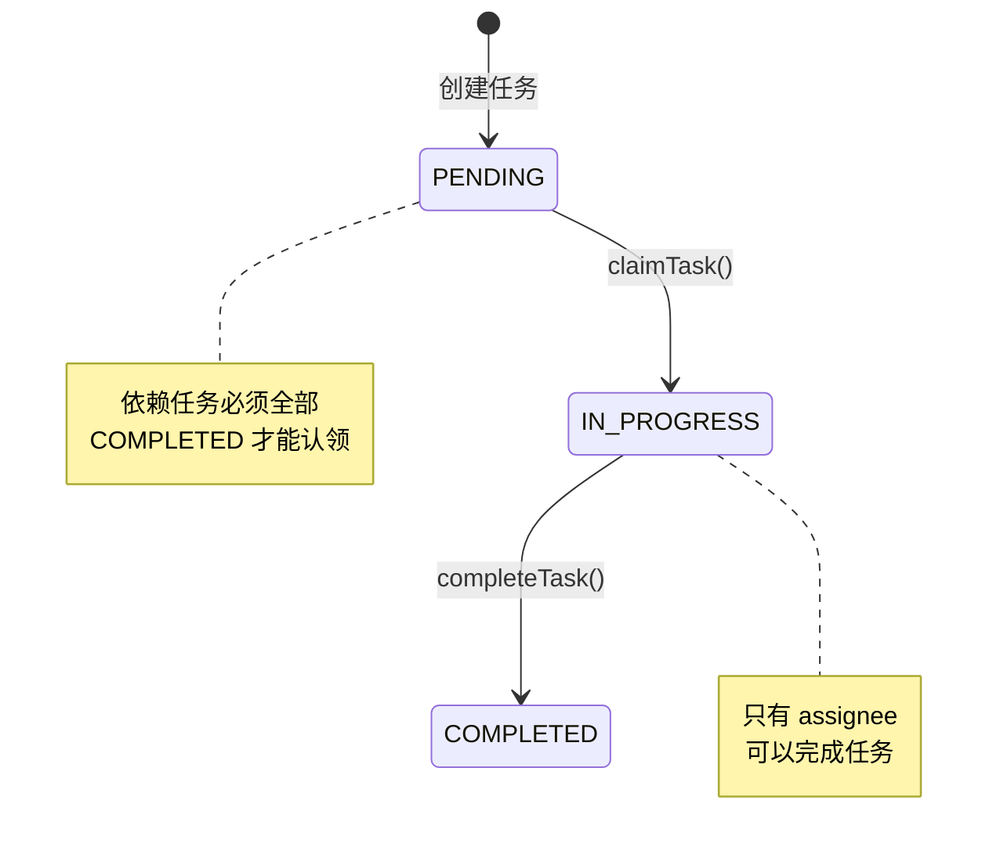
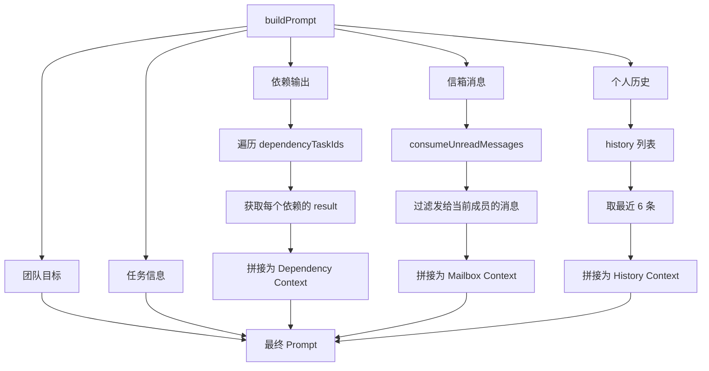
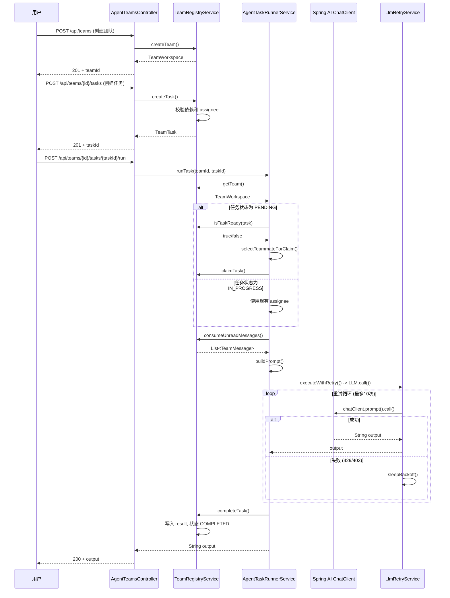
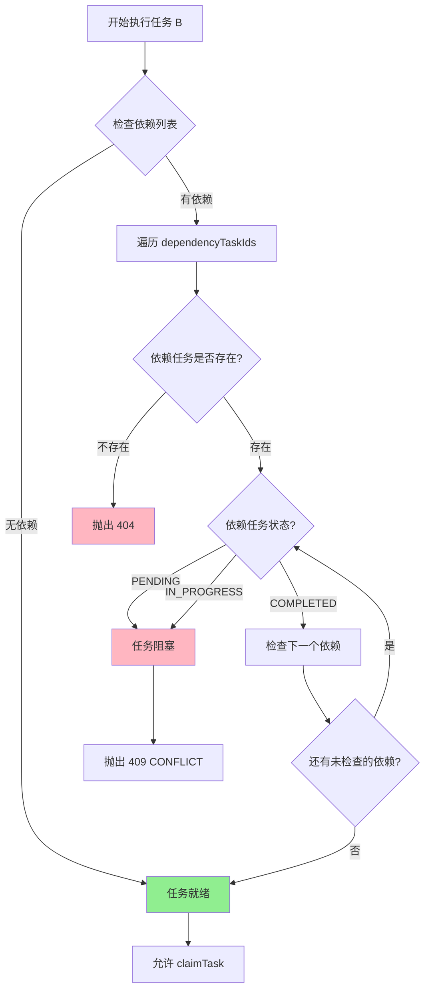
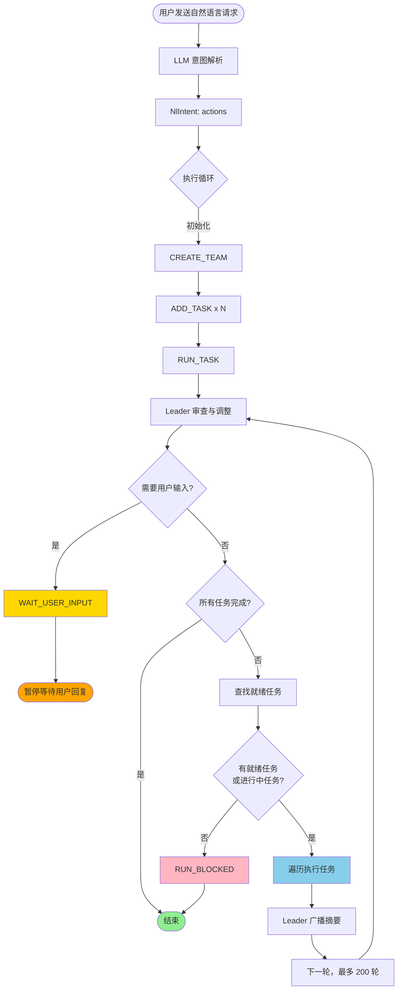
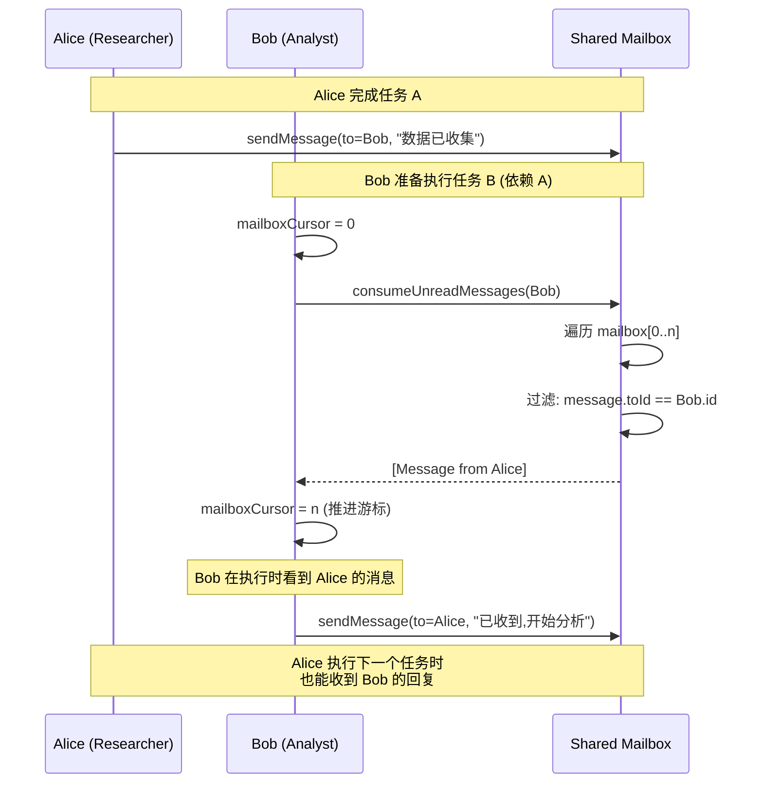
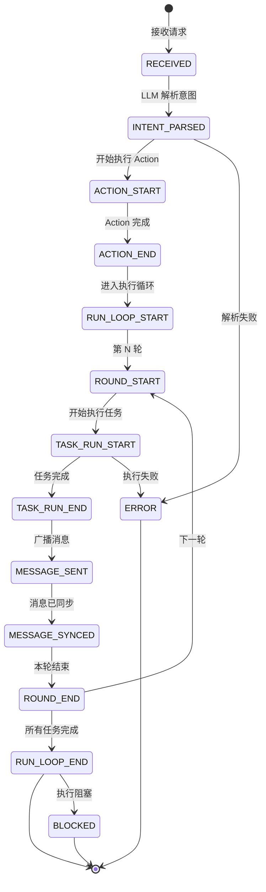
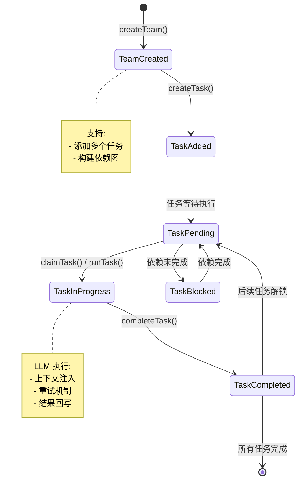

# RAG Agent Teams 系统设计文档

## 目录
- [1. 项目概述](#1-项目概述)
- [2. 架构设计](#2-架构设计)
- [3. 核心代码设计](#3-核心代码设计)
- [4. 流程设计](#4-流程设计)
- [5. 关键设计模式](#5-关键设计模式)
- [6. 技术栈与依赖](#6-技术栈与依赖)
- [7. 配置说明](#7-配置说明)

---

## 1. 项目概述

### 1.1 项目简介

**RAG Agent Teams** 是一个基于 Spring Boot 的 AI 代理团队编排系统，灵感来自 Claude Agent Teams 架构。该系统实现了一个轻量级的多代理协作框架，让具有不同角色的 AI 代理能够通过结构化工作流、消息传递和任务依赖关系协同工作。

### 1.2 核心特性

- ✅ **多代理协作**: 支持创建具有不同角色的 AI 代理团队
- ✅ **任务依赖图**: DAG（有向无环图）式任务依赖管理
- ✅ **智能任务调度**: 自动负载均衡和角色感知的任务分配
- ✅ **消息传递机制**: 代理间通过共享邮箱通信
- ✅ **上下文感知执行**: 多源上下文注入（依赖输出、信箱消息、历史记录）
- ✅ **LLM 弹性调用**: 指数退避重试机制（429/403 错误）
- ✅ **自然语言接口**: 双接口支持（REST API + 自然语言）
- ✅ **实时流式反馈**: SSE（Server-Sent Events）工作流事件流

### 1.3 系统定位

**当前状态**: 原型/演示系统
**生产就绪度**: 低（内存状态、有限测试、单机部署）
**扩展性**: 强（清晰的分层架构和扩展点）

---

## 2. 架构设计

### 2.1 分层架构

```
┌─────────────────────────────────────────────┐
│         API Layer (接口层)                   │
│  - AgentTeamsController                    │
│  - AgentTeamsNaturalLanguageController    │
└─────────────────┬───────────────────────────┘
                  │
┌─────────────────▼───────────────────────────┐
│      Service Layer (业务逻辑层)              │
│  - TeamRegistryService (状态管理)          │
│  - AgentTaskRunnerService (任务执行)       │
│  - LlmRetryService (弹性重试)              │
│  - NlAgentTeamsService (自然语言处理)      │
└─────────────────┬───────────────────────────┘
                  │
┌─────────────────▼───────────────────────────┐
│      Domain Layer (领域模型层)               │
│  - TeamWorkspace (聚合根)                  │
│  - TeamTask (任务实体)                     │
│  - TeammateAgent (代理实体)                │
│  - TeamMessage (值对象)                    │
│  - TaskStatus (枚举)                       │
└─────────────────────────────────────────────┘
```

### 2.2 模块组织

```
com.gengzi.agentteams/
├── AgentTeamsApplication.java           # Spring Boot 入口
├── api/                                # REST API 层
│   ├── AgentTeamsController.java         # 核心 API 接口
│   ├── AgentTeamsNaturalLanguageController.java  # 自然语言接口
│   ├── CreateTeamRequest.java            # 请求 DTO
│   ├── CreateTaskRequest.java
│   ├── ClaimTaskRequest.java
│   ├── CompleteTaskRequest.java
│   ├── MessageRequest.java
│   ├── RunTaskRequest.java
│   └── TeamStateResponse.java            # 响应 DTO
├── domain/                             # 领域模型层
│   ├── TeamWorkspace.java              # 聚合根
│   ├── TeamTask.java                   # 任务实体
│   ├── TeammateAgent.java              # 代理实体
│   ├── TeamMessage.java                # 消息值对象 (record)
│   └── TaskStatus.java                 # 状态枚举
├── service/                           # 业务逻辑层
│   ├── TeamRegistryService.java        # 团队注册与状态管理
│   ├── AgentTaskRunnerService.java     # 任务执行编排
│   └── LlmRetryService.java           # LLM 重试机制
└── nl/                               # 自然语言处理模块
    ├── NlAgentTeamsService.java       # NL 意图解析与工作流
    ├── NlIntent.java                # 意图结构
    ├── NlChatRequest.java
    ├── NlChatResponse.java
    ├── NlWorkflowEvent.java          # 工作流事件
    └── NlSessionStore.java           # 会话管理
```

### 2.3 部署架构（当前）

```
┌─────────────────────────────────────────┐
│         Client Layer                    │
│  - REST Client / Browser               │
└─────────────┬───────────────────────────┘
              │ HTTP/REST + SSE
┌─────────────▼───────────────────────────┐
│      Spring Boot Application           │
│      (Port 8080)                       │
│                                       │
│  ┌─────────────────────────────────┐  │
│  │  In-Memory Team Registry        │  │
│  │  ConcurrentHashMap              │  │
│  └─────────────────────────────────┘  │
│                                       │
│  ┌─────────────────────────────────┐  │
│  │  Spring AI ChatClient           │  │
│  └──────────────┬──────────────────┘  │
└─────────────────┼──────────────────────┘
                  │ HTTP
┌─────────────────▼──────────────────────┐
│      LLM Provider (OpenAI Compatible)  │
│      Proxy: http://127.0.0.1:8045      │
└─────────────────────────────────────────┘
```

---

## 3. 核心代码设计

### 3.1 领域模型 (Domain Layer)

#### 3.1.1 TeamWorkspace (聚合根)

**职责**: 作为聚合根管理整个团队的一致性边界

```java
public class TeamWorkspace {
    private final String id;                  // UUID
    private final String name;                // 团队名称
    private final String objective;           // 团队目标
    private final Map<String, TeammateAgent> teammates;  // 成员集合
    private final Map<String, TeamTask> tasks;           // 任务集合
    private final List<TeamMessage> mailbox;            // 共享邮箱
    private final Instant createdAt;          // 创建时间
    private long planVersion;                 // 计划版本号（每次计划变更自增）
}
```

**关键方法**:
```java
// 增加 planVersion 并返回新值
public long bumpPlanVersion() {
    this.planVersion++;
    return this.planVersion;
}
```

**设计要点**:
- **聚合根模式**: 所有的外部操作必须通过 TeamWorkspace 进行
- **不可变 ID**: 创建后不可修改，保证身份稳定性
- **聚合内集合**: 使用 LinkedHashMap 保持插入顺序
- **时间戳**: 使用 Instant 保证时区无关性
- **计划版本追踪**: `planVersion` 字段追踪计划的变更历史，每次新增/更新/删除任务时自增，便于日志追踪和状态同步

#### 3.1.2 TeamTask (任务实体)

**职责**: 表示一个可执行的原子工作单元，支持依赖关系和动态修改

```java
public class TeamTask {
    private final String id;                  // UUID
    private String title;                     // 任务标题（可修改）
    private String description;                // 详细描述（可修改）
    private final List<String> dependencyTaskIds;  // 前置依赖（可替换）
    private TaskStatus status;               // PENDING | IN_PROGRESS | COMPLETED
    private String assigneeId;               // 执行人ID
    private String result;                   // 执行结果
    private final Instant createdAt;
    private Instant updatedAt;               // 状态变化时间戳（任何修改都更新）
}
```

**关键方法**:
```java
// 更新标题（会更新 updatedAt）
public void setTitle(String title) {
    this.title = title;
    this.updatedAt = Instant.now();
}

// 更新描述（会更新 updatedAt）
public void setDescription(String description) {
    this.description = description;
    this.updatedAt = Instant.now();
}

// 替换依赖列表（会更新 updatedAt）
public void replaceDependencies(List<String> dependencies) {
    this.dependencyTaskIds.clear();
    this.dependencyTaskIds.addAll(dependencies);
    this.updatedAt = Instant.now();
}

// 其他 setter 方法也会自动更新 updatedAt
```

**状态机转换**:



**设计要点**:
- **依赖追踪**: `dependencyTaskIds` 列表支持 DAG 依赖图
- **状态自封装**: 状态变更时自动更新 `updatedAt` 时间戳
- **可变字段**: `status`、`assigneeId`、`result` 可变，其余不可变

#### 3.1.3 TeammateAgent (代理实体)

**职责**: 表示一个具有角色、记忆和消息处理能力的 AI 代理

```java
public class TeammateAgent {
    private final String id;                // UUID
    private final String name;              // 显示名称
    private final String role;              // 角色职责 (Researcher/Analyst/...)
    private final String model;             // 默认模型
    private final List<String> history;    // 对话历史 (私有记忆)
    private int mailboxCursor;              // 邮箱消费游标
}
```

**设计要点**:
- **私有记忆**: `history` 列表保存个人上下文（最近6条）
- **增量消费**: `mailboxCursor` 游标机制避免重复读取消息
- **角色推断**: 通过 `role` 字符串模式匹配判断是否为 leader

#### 3.1.4 TeamMessage (值对象)

**职责**: 代理间通信的不可变消息载体

```java
public record TeamMessage(
    String fromId,        // 发送者ID
    String toId,          // 接收者ID
    String content,       // 消息内容
    Instant createdAt     // 发送时间
) {}
```

**设计要点**:
- **Java Record**: 自动实现不可变性、equals、hashCode、toString
- **事实语义**: 消息是历史事实，不应被修改
- **时序保证**: `createdAt` 保证消息排序

---

### 3.2 服务层 (Service Layer)

#### 3.2.1 TeamRegistryService (状态管理)

**职责**: 团队、任务、消息的 CRUD 操作与并发控制

**核心方法**:

```java
@Service
public class TeamRegistryService {

    // 团队仓库: teamId -> TeamWorkspace
    private final Map<String, TeamWorkspace> teams = new ConcurrentHashMap<>();

    // 创建团队并注册成员
    public TeamWorkspace createTeam(String name, String objective,
                                   List<TeammateSpec> teammateSpecs);

    // 创建任务（校验依赖和指派人）
    public TeamTask createTask(String teamId, String title, String description,
                             List<String> dependencies, String assigneeId);

    // 更新任务计划（仅 PENDING 状态任务可更新）
    public TeamTask updateTaskPlan(String teamId, String taskId,
                                  String title, String description,
                                  List<String> dependencies, String assigneeId);

    // 删除任务计划（仅 PENDING 状态任务可删除，且不能被其他活跃任务引用）
    public void deleteTaskPlan(String teamId, String taskId);

    // 认领任务（依赖检查 + 状态转换）
    public TeamTask claimTask(String teamId, String taskId, String teammateId);

    // 完成任务（授权检查 + 状态转换）
    public TeamTask completeTask(String teamId, String taskId,
                                String teammateId, String result);

    // 发送消息（校验发送者和接收者）
    public TeamMessage sendMessage(String teamId, String fromId,
                                  String toId, String content);

    // 消费未读消息（游标推进）
    public List<TeamMessage> consumeUnreadMessages(TeamWorkspace team,
                                                   TeammateAgent teammate);

    // 查询团队状态（聚合视图）
    public TeamStateResponse getState(String teamId);

    // 判断任务是否就绪（依赖全部完成）
    public boolean isTaskReady(TeamWorkspace team, TeamTask task);

    // 确保团队有 Leader（如果没有会自动创建）
    private void ensureLeaderPresent(TeamWorkspace team);
}
```

**新增功能说明**:

1. **任务计划更新** (`updateTaskPlan`):
   - 只能更新状态为 PENDING 的任务
   - 支持修改标题、描述、依赖关系和执行人
   - 会校验依赖任务是否存在
   - 防止任务自依赖
   - 更新后自动增加 `planVersion`

2. **任务计划删除** (`deleteTaskPlan`):
   - 只能删除状态为 PENDING 的任务
   - 检查任务是否被其他活跃任务引用
   - 删除后自动增加 `planVersion`

3. **自动 Leader 创建** (`ensureLeaderPresent`):
   - 在创建团队和获取团队时自动调用
   - 检测是否存在 leader 角色（包含 leader/lead/manager/planner/orchestrator 关键词）
   - 如果没有 leader，自动创建 "Team Leader" 角色
   - 记录日志便于追踪

**并发控制设计**:

```java
// Team 级别的细粒度锁
synchronized (team) {
    // 所有的 team 状态修改都在锁内进行
    // 允许不同 team 的并发操作
}
```

**设计要点**:
- **单一职责**: 只负责状态管理和一致性校验，不包含业务逻辑
- **细粒度锁**: 以 `team` 对象为锁粒度，而非全局锁
- **早期校验**: 在操作前校验所有前置条件，fail-fast
- **HTTP 语义**: 使用 `ResponseStatusException` 映射 HTTP 状态码
  - `400 BAD_REQUEST`: 请求参数错误（如 assigneeId 不存在）
  - `404 NOT_FOUND`: 资源不存在（如 team/task 不存在）
  - `409 CONFLICT`: 状态冲突（如任务不在 PENDING 状态）

#### 3.2.2 AgentTaskRunnerService (任务执行)

**职责**: LLM 调用编排、上下文注入、自动分配

**核心方法**:

```java
@Service
public class AgentTaskRunnerService {

    private final TeamRegistryService teamRegistryService;
    private final ChatClient.Builder chatClientBuilder;
    private final LlmRetryService llmRetryService;

    /**
     * 执行指定任务:
     * 1. 组装上下文（依赖输出、信箱消息、个人历史）
     * 2. 调用 LLM（带重试）
     * 3. 回写任务结果
     */
    public String runTask(String teamId, String taskId,
                         String teammateIdOverride);

    /**
     * 自动选择执行器:
     * 1. 过滤 leader 角色（协调者不执行具体任务）
     * 2. 统计每个成员的 in-progress 任务数
     * 3. 选择最空闲的成员
     * 4. ID 作为确定性打破平局
     */
    private String selectTeammateForClaim(TeamWorkspace team);

    /**
     * 构建上下文感知 Prompt:
     * - 团队目标
     * - 任务标题和描述
     * - 依赖任务输出
     * - 未读信箱消息
     * - 最近个人历史（6条）
     */
    private String buildPrompt(TeamWorkspace team, TeamTask task,
                              TeammateAgent teammate,
                              List<TeamMessage> unread);
}
```

**Prompt 构建流程**:



**自动分配算法**:

```java
private String selectTeammateForClaim(TeamWorkspace team) {
    // 1. 过滤 leader 角色
    List<TeammateAgent> executors = team.getTeammates().values()
        .stream()
        .filter(t -> !isLeaderRole(t.getRole()))
        .toList();

    if (executors.isEmpty()) {
        executors = all;  // 如果全是 leader，降级到所有成员
    }

    // 2. 统计当前负载 (in-progress 任务数)
    Map<String, Long> workload = team.getTasks().values()
        .stream()
        .filter(t -> t.getStatus() == TaskStatus.IN_PROGRESS)
        .collect(groupingBy(TeamTask::getAssigneeId, counting()));

    // 3. 选择负载最低的成员（平局时用 ID 打破）
    return executors.stream()
        .min(comparingLong(t -> workload.getOrDefault(t.getId(), 0L))
            .thenComparing(TeammateAgent::getId))
        .map(TeammateAgent::getId)
        .orElseThrow();
}
```

**设计要点**:
- **自动分配**: 未指定执行人时自动选择最合适的成员
- **角色感知**: leader 负责规划，优先不执行具体任务
- **负载均衡**: 基于当前 in-progress 任务数的贪心算法
- **多源上下文**: 依赖链 + 社交消息 + 个人记忆

#### 3.2.3 LlmRetryService (弹性重试)

**职责**: LLM 调用失败重试、指数退避

**核心实现**:

```java
@Service
public class LlmRetryService {

    private static final int MAX_ATTEMPTS = 10;

    public String executeWithRetry(Supplier<String> call) {
        RuntimeException last = null;
        for (int attempt = 1; attempt <= MAX_ATTEMPTS; attempt++) {
            try {
                return call.get();  // 执行 LLM 调用
            } catch (RuntimeException ex) {
                last = ex;
                if (!isRetryable(ex) || attempt >= MAX_ATTEMPTS) {
                    throw ex;  // 不可重试或达到上限
                }
                sleepBackoff(attempt);  // 指数退避
            }
        }
        throw last;
    }

    // 判断异常是否可重试
    private boolean isRetryable(Throwable throwable) {
        // 遍历异常链
        Throwable current = throwable;
        while (current != null) {
            if (current instanceof RestClientResponseException e) {
                int code = e.getStatusCode().value();
                if (code == 429) return true;  // 速率限制
                if (code == 403 && containsExhaustedHint(e.getResponseBodyAsString())) {
                    return true;  // 额度耗尽（某些网关映射为 403）
                }
            }
            current = current.getCause();
        }
        return false;
    }

    // 指数退避: 300ms, 600ms, 900ms ... 最多 3000ms
    private void sleepBackoff(int attempt) {
        long millis = Math.min(300L * attempt, 3000L);
        Thread.sleep(millis);
    }
}
```

**重试策略表**:

| 尝试次数 | 等待时间 | 累计时间 |
|---------|---------|---------|
| 1       | 300ms  | 300ms  |
| 2       | 600ms  | 900ms  |
| 3       | 900ms  | 1.8s   |
| 4       | 1.2s   | 3.0s   |
| ...     | ...    | ...    |
| 10      | 3.0s   | 16.5s  |

**设计要点**:
- **智能重试**: 仅对 429/403（额度耗尽）重试
- **指数退避**: 避免雪崩，防止拥塞
- **上限控制**: 最多 10 次，防止无限等待
- **异常链遍历**: 处理嵌套异常

---

## 4. 流程设计

### 4.1 REST API 任务执行流程



### 4.2 任务依赖解析流程



### 4.3 自动任务执行循环 (自然语言接口)



**Leader 动态调整能力**:

每一轮执行前，Leader 会审查当前状态并可以执行以下操作：

1. **ADD_TASK**: 动态添加新任务
2. **UPDATE_TASK**: 修改待执行任务的标题、描述、依赖或执行人
3. **DELETE_TASK**: 删除不再需要的任务
4. **SEND_MESSAGE**: 向特定成员发送消息
5. **BROADCAST**: 向所有成员广播消息
6. **请求用户输入**: 当遇到需要决策的情况时，暂停执行并等待用户回复

**执行循环特点**:
- **最大轮次**: 200 轮（防止无限循环）
- **自动终止**: 所有任务完成或无任务可执行
- **阻塞检测**: 所有待执行任务依赖未满足时停止
- **用户介入**: 支持在执行过程中暂停并等待用户输入

### 4.4 消息传递与消费流程



### 4.5 SSE 流式事件推送



---

## 5. 关键设计模式

### 5.1 领域驱动设计 (DDD) 模式

#### 聚合根模式 (Aggregate Root)

```java
// TeamWorkspace 是聚合根，外部只能通过它访问内部实体
public class TeamWorkspace {
    private final Map<String, TeammateAgent> teammates;  // 聚合内实体
    private final Map<String, TeamTask> tasks;            // 聚合内实体
    private final List<TeamMessage> mailbox;              // 聚合内值对象
}

// 所有操作都通过 TeamWorkspace 进行，保证一致性
synchronized (team) {
    // 在聚合根锁内操作所有状态
}
```

**优点**:
- 保证聚合内一致性
- 封装业务规则
- 防止外部直接修改内部实体

#### 值对象模式 (Value Object)

```java
// TeamMessage 是不可变值对象
public record TeamMessage(
    String fromId,
    String toId,
    String content,
    Instant createdAt
) {}

// 使用时直接替换，不修改原对象
team.getMailbox().add(new Message(from, to, content, now));
```

**优点**:
- 天然线程安全
- 简化值比较（equals/hashCode 自动生成）
- 明确语义（消息是事实）

### 5.2 并发编程模式

#### 细粒度锁 (Fine-Grained Locking)

```java
// 每个团队一个锁，不同团队可并发操作
public TeamTask claimTask(String teamId, String taskId, String teammateId) {
    TeamWorkspace team = getTeam(teamId);
    synchronized (team) {  // 只锁当前 team
        // 状态修改
    }
}
```

**优点**:
- 相比全局锁提高并发度
- 满足业务隔离性（不同团队互不影响）

#### 游标模式 (Cursor Pattern)

```java
public class TeammateAgent {
    private int mailboxCursor;  // 当前读到第几条

    // 增量读取，不复制整个列表
    public List<TeamMessage> consumeUnread(TeamWorkspace team) {
        for (int i = mailboxCursor; i < team.getMailbox().size(); i++) {
            // 处理未读消息
        }
        mailboxCursor = team.getMailbox().size();  // 推进游标
    }
}
```

**优点**:
- 避免消息重复处理
- 高效（不需要维护已读消息集合）
- O(1) 空间复杂度

### 5.3 行为模式

#### 策略模式 (Strategy Pattern) - LLM 重试

```java
// 不同的重试策略可以扩展
public interface RetryStrategy {
    boolean isRetryable(Throwable ex);
    long backoff(int attempt);
}

// 当前实现: 指数退避策略
public class ExponentialBackoffStrategy implements RetryStrategy {
    public long backoff(int attempt) {
        return Math.min(300L * attempt, 3000L);
    }
}
```

#### 模板方法模式 (Template Method) - 任务执行

```java
// AgentTaskRunnerService 定义执行模板
public String runTask(...) {
    // 1. 准备阶段
    prepareTask();

    // 2. 上下文构建
    String prompt = buildPrompt();

    // 3. 执行阶段（子步骤可扩展）
    String output = llmRetryService.executeWithRetry(() -> {
        return chatClient.call();
    });

    // 4. 完成阶段
    completeTask();

    return output;
}
```

### 5.4 创建型模式

#### 构建器模式 (Builder Pattern) - Prompt 构建

```java
private String buildPrompt(...) {
    StringBuilder sb = new StringBuilder();
    sb.append("Team objective:\n").append(team.getObjective()).append("\n\n");
    sb.append("Task title: ").append(task.getTitle()).append("\n");
    sb.append("Task details:\n").append(task.getDescription()).append("\n\n");
    sb.append("Dependency outputs:\n").append(dependencyContext).append("\n\n");
    sb.append("Unread mailbox:\n").append(mailboxContext).append("\n\n");
    sb.append("Recent context:\n").append(historyContext).append("\n\n");
    sb.append("Return a concise deliverable for this task.");
    return sb.toString();
}
```

---

## 6. 技术栈与依赖

### 6.1 核心技术

| 技术 | 版本 | 用途 |
|-----|------|-----|
| Java | 17+ | 编程语言 |
| Spring Boot | 3.x | 应用框架 |
| Spring AI | 1.0.0-M4 | LLM 抽象层 |
| SpringDoc OpenAPI | 2.5.0 | API 文档 |
| Gradle | 8.x | 构建工具 |

### 6.2 关键依赖

```gradle
dependencies {
    // Spring Boot 核心
    implementation 'org.springframework.boot:spring-boot-starter-web'
    implementation 'org.springframework.boot:spring-boot-starter-validation'

    // Spring AI (LLM 抽象)
    implementation 'org.springframework.ai:spring-ai-openai-spring-boot-starter'

    // API 文档
    implementation 'org.springdoc:springdoc-openapi-starter-webmvc-ui:2.5.0'

    // 测试
    testImplementation 'org.springframework.boot:spring-boot-starter-test'
}
```

### 6.3 配置管理

**application.yml**:

```yaml
spring:
  application:
    name: rag-agent-teams

  # Spring AI OpenAI 配置
  ai:
    openai:
      base-url: http://127.0.0.1:8045  # 代理端点
      api-key: ${OPENAI_API_KEY}          # 环境变量注入
      chat:
        options:
          model: claude-sonnet-4-5        # 统一模型配置

server:
  port: 8080

# SpringDoc OpenAPI 配置
springdoc:
  api-docs:
    path: /v3/api-docs
  swagger-ui:
    path: /swagger-ui.html
```

**环境变量**:

```bash
# Windows PowerShell
$env:OPENAI_API_KEY="sk-your-api-key"

# Linux/macOS
export OPENAI_API_KEY="sk-your-api-key"
```

---

## 7. 配置说明

### 7.1 端点映射

| 功能 | 方法 | 路径 | 说明 |
|-----|------|-----|------|
| 创建团队 | POST | /api/teams | 初始化团队和成员 |
| 查询状态 | GET | /api/teams/{teamId} | 获取完整团队状态 |
| 创建任务 | POST | /api/teams/{teamId}/tasks | 添加任务到团队 |
| 认领任务 | POST | /api/teams/{teamId}/tasks/{taskId}/claim | 标记任务进行中 |
| 完成任务 | POST | /api/teams/{teamId}/tasks/{taskId}/complete | 提交任务结果 |
| 发送消息 | POST | /api/teams/{teamId}/messages | 代理间通信 |
| 执行任务 | POST | /api/teams/{teamId}/tasks/{taskId}/run | AI 执行任务 |
| NL 聊天 | POST | /api/teams/nl/chat | 同步自然语言接口 |
| NL 流式聊天 | POST | /api/teams/nl/chat/stream | SSE 流式工作流 |

### 7.2 数据模型

#### CreateTeamRequest

```json
{
  "name": "Market Analysis Team",
  "objective": "调研北美 AI Agent 产品机会并输出结论",
  "teammates": [
    { "name": "Alice", "role": "Researcher" },
    { "name": "Bob", "role": "Analyst" }
  ]
}
```

#### CreateTaskRequest

```json
{
  "title": "收集竞品信息",
  "description": "列出 5 个竞品并总结定位",
  "dependencies": [],
  "assigneeId": "teammate-id-or-null"
}
```

#### TeamStateResponse

```json
{
  "id": "team-uuid",
  "name": "Market Analysis Team",
  "objective": "调研北美 AI Agent 产品机会并输出结论",
  "createdAt": "2025-02-14T10:00:00Z",
  "teammates": [
    {
      "id": "teammate-uuid",
      "name": "Alice",
      "role": "Researcher",
      "model": "claude-sonnet-4-5"
    }
  ],
  "tasks": [
    {
      "id": "task-uuid",
      "title": "收集竞品信息",
      "description": "列出 5 个竞品",
      "dependencies": [],
      "status": "COMPLETED",
      "assigneeId": "teammate-uuid",
      "result": "1. Product A...\n2. Product B..."
    }
  ]
}
```

### 7.3 错误码映射

| HTTP 状态 | 场景 | 示例 |
|----------|------|------|
| 400 | 请求参数错误 | assigneeId 不存在 |
| 404 | 资源不存在 | teamId/taskId 找不到 |
| 409 | 状态冲突 | 任务不在 PENDING 状态 |
| 500 | 系统错误 | LLM 调用失败（达到重试上限） |

### 7.4 模型配置策略

**当前设计**:

```java
// 所有代理统一使用配置文件中的模型
private final String configuredModel;

// TeamRegistryService 构造时注入
public TeamRegistryService(
    @Value("${spring.ai.openai.chat.options.model}") String model
) {
    this.configuredModel = model;
}

// 创建代理时统一使用
TeammateAgent teammate = new TeammateAgent(
    spec.getName(),
    spec.getRole(),
    configuredModel  // 忽略请求中的 model 字段
);
```

**优点**:
- 成本可控（统一模型）
- 行为一致（便于测试）
- 配置简单（无需 per-agent 模型管理）

**未来扩展**:
- 支持 per-agent 模型配置
- 支持任务级别模型选择
- 支持模型降级策略

---

## 8. 扩展与改进

### 8.1 短期改进 (1-3 个月)

#### 持久化层

```java
// 当前: 内存状态
private final Map<String, TeamWorkspace> teams = new ConcurrentHashMap<>();

// 目标: 数据库持久化
@Entity
public class TeamWorkspace {
    @Id @GeneratedValue
    private String id;
    @OneToMany(cascade = CascadeType.ALL)
    private List<TeamTask> tasks;
    // ...
}

public interface TeamWorkspaceRepository extends JpaRepository<TeamWorkspace, String> {
}
```

#### 增强测试

```java
@SpringBootTest
class AgentTaskRunnerServiceTest {

    @MockBean
    private ChatClient chatClient;

    @Test
    void shouldExecuteTaskWithRetry() {
        // 模拟 429 错误
        when(chatClient.prompt()...call())
            .thenThrow(new RestClientResponseException(..., 429, ""))
            .thenReturn("Success");

        String result = service.runTask(teamId, taskId, null);
        assertEquals("Success", result);
    }
}
```

### 8.2 长期规划 (6-12 个月)

#### 分布式执行

```
┌─────────────┐     ┌─────────────┐
│  Node A     │     │  Node B     │
│  Team 1     │     │  Team 2     │
└──────┬──────┘     └──────┬──────┘
       │                   │
       └─────────┬─────────┘
                 │
        ┌────────▼─────────┐
        │  Message Queue  │
        │  (RabbitMQ/Kafka)│
        └──────────────────┘
```

**改进点**:
- 使用乐观锁替换 `synchronized(team)`
- 任务队列异步执行
- 多节点水平扩展

#### 高级编排

```java
// 当前: 简单依赖图
public class TeamTask {
    private List<String> dependencyTaskIds;
}

// 目标: DAG 调度器
public interface TaskScheduler {
    List<Task> schedule(DependencyGraph graph);
    void executeInParallel(List<Task> tasks);
    void branchOnCondition(Task task, Condition cond);
}
```

---

## 9. 附录

### 9.1 Leader 角色检测逻辑

```java
private boolean isLeaderRole(String role) {
    if (role == null) {
        return false;
    }
    String lower = role.toLowerCase(Locale.ROOT);
    return lower.contains("leader")
        || lower.contains("lead")
        || lower.contains("manager")
        || lower.contains("planner")
        || lower.contains("orchestrator");
}
```

### 9.2 意图解析 Prompt 模板

```
You are a team orchestrator. Parse the user request into structured actions.

User request: {userInput}

Return JSON:
{
  "assistantReply": "optional text response to user",
  "actions": [
    {
      "type": "CREATE_TEAM|ADD_TASK|SEND_MESSAGE|BROADCAST|RUN_TASK|GET_STATE|CHAT",
      "teamName": "...",
      "objective": "...",
      "teammates": [...],
      "taskTitle": "...",
      "taskDescription": "...",
      "dependencies": [...],
      "assigneeId": "...",
      "fromId": "...",
      "toId": "...",
      "content": "...",
      "maxRounds": 10
    }
  ]
}
```

### 9.3 系统状态机总览



---

## 10. 总结

### 10.1 设计优势

✅ **清晰的架构**: 分层架构，职责分离
✅ **弹性设计**: LLM 重试、错误处理、降级策略
✅ **可扩展性**: 接口抽象、策略模式、易于扩展
✅ **开发友好**: Swagger 文档、实时反馈流
✅ **学习价值**: DDD 实践、并发模式、LLM 应用

### 10.2 适用场景

- ✅ 多代理协作研究
- ✅ 复杂任务分解与并行处理
- ✅ 知识工作流自动化
- ✅ AI Agent 系统原型验证

### 10.3 不适用场景

- ❌ 高吞吐量生产系统（内存状态、单机锁）
- ❌ 需要强持久化的场景（重启丢失数据）
- ❌ 超低延迟要求（LLM 调用慢）

### 10.4 生产化路径

1. **Phase 1 (当前)**: 原型验证
2. **Phase 2**: 持久化 + 增强测试
3. **Phase 3**: 分布式 + 高可用
4. **Phase 4**: 高级编排 + 人工干预

---

**文档版本**: 1.1.0
**最后更新**: 2025-02-15
**更新内容**:
- 新增 TeamWorkspace.planVersion 计划版本追踪
- 新增 TeamTask 动态修改能力（title, description, dependencies）
- 新增 TeamRegistryService.updateTaskPlan() 和 deleteTaskPlan() 方法
- 新增自动 Leader 创建机制（ensureLeaderPresent）
- 更新自然语言接口的 Leader 动态调整能力（最多 200 轮）
- 新增用户输入暂停机制（needsUserInput, userQuestion）
- 更新各种流程图和设计模式说明

**维护者**: RAG Agent Teams Team
