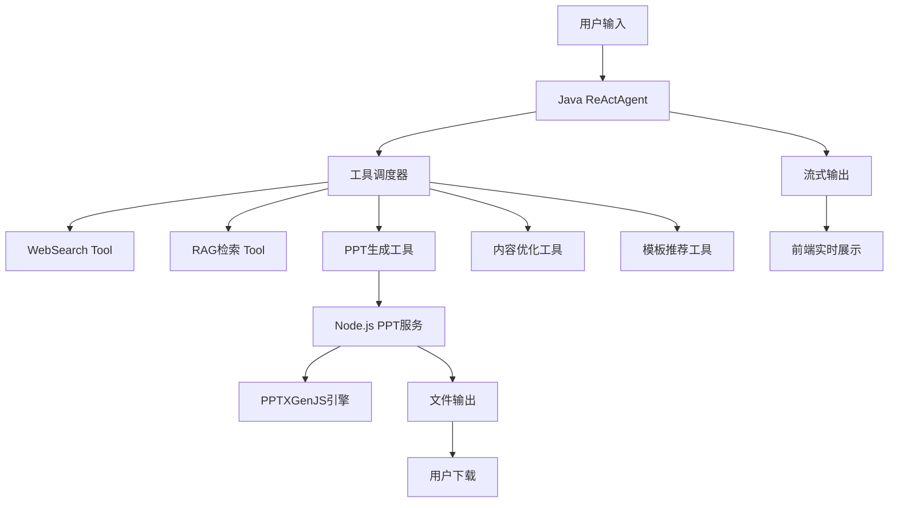
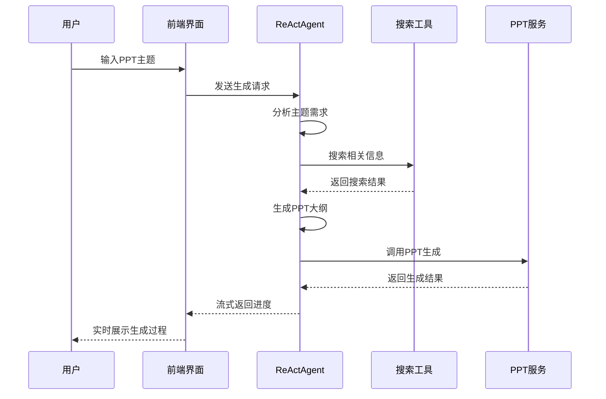

# AI PPT 智能生成系统 - 产品设计文档

## 1. 产品概述

### 1.1 产品简介
AI PPT 智能生成系统是一个基于 ReAct 模式的智能演示文稿生成平台，通过 AI 技术自动分析用户需求，检索相关信息，并生成专业的 PPT 文档。

### 1.2 产品愿景
让用户通过简单的主题描述，快速获得高质量、专业化的演示文稿，大幅提升工作效率。

### 1.3 核心价值
- **智能化生成**：基于 ReAct 模式的智能思考和行动
- **专业内容**：结合实时搜索和知识库的专业内容
- **个性化定制**：支持多种模板和风格选择
- **实时交互**：流式展示生成过程，用户体验优秀

## 2. 产品目标

### 2.1 核心目标
- [ ] 5分钟内生成基础PPT
- [ ] 支持多种专业领域主题
- [ ] 提供至少20套专业模板
- [ ] 内容准确率达到90%以上
- [ ] 用户满意度达到4.5/5分

### 2.2 用户目标
- **时间节省**：比手动制作节省80%时间
- **质量提升**：内容专业度和设计美观度
- **易用性**：零学习成本，上手即用

## 3. 目标用户

### 3.1 主要用户群体
1. **商务人士**：需要快速制作业务演示
2. **学生群体**：制作学术报告和课题展示
3. **培训讲师**：创建培训材料和课程内容
4. **市场人员**：制作产品介绍和营销方案

### 3.2 用户场景
- 工作汇报演示
- 产品发布介绍
- 学术报告展示
- 培训课程材料
- 营销方案展示

## 4. 技术架构

### 4.1 整体架构图



### 4.2 核心技术栈

**后端服务**
- **Java Spring Boot**：主服务框架
- **ReActAgent**：智能代理核心
- **OpenAI API**：大语言模型
- **Elasticsearch**：RAG检索引擎
- **Node.js**：PPT生成服务

**PPT生成**
- **PPTXGenJS**：JavaScript PPT生成库
- **Express.js**：PPT服务框架
- **Template Engine**：模板渲染引擎

**前端展示**
- **React + TypeScript**：用户界面
- **SSE**：实时流式传输
- **Canvas**：PPT预览渲染

## 5. 功能模块设计

### 5.1 ReAct Agent 核心模块

```java
// Agent 核心架构
public class AIPPTAgent extends ReActAgent {

    // 思考阶段：分析用户需求，制定生成策略
    @Override
    public boolean think() {
        // 1. 分析主题类型和复杂度
        // 2. 确定所需工具和步骤
        // 3. 设计PPT结构框架
    }

    // 行动阶段：执行具体工具调用
    @Override
    public String act() {
        // 1. 调用搜索工具获取信息
        // 2. 调用RAG工具检索模板
        // 3. 调用PPT生成工具创建内容
    }
}
```

### 5.2 工具体系架构

#### 5.2.1 信息检索层工具

**WebSearchTool**
- 功能：搜索最新信息和趋势
- 搜索引擎：Google API / Bing API
- 结果处理：内容清洗和相关性评分

```java
public class WebSearchTool extends BaseTool {
    @Override
    public ToolResult execute(ToolInput input) {
        // 1. 构建搜索查询
        // 2. 调用搜索引擎API
        // 3. 结果清洗和排序
        // 4. 返回相关内容摘要
    }
}
```

**RAGRetrievalTool**
- 功能：检索内部知识库和模板
- 存储：Elasticsearch + Vector Database
- 检索：混合检索（关键词+语义）

#### 5.2.2 内容生成层工具

**PPTGeneratorTool** - 核心工具
- 功能：生成PPT整体结构和大纲
- 输出：JSON格式的幻灯片结构

```javascript
// PPT结构JSON示例
{
  "title": "AI发展趋势报告2024",
  "slideCount": 12,
  "template": "business-professional",
  "slides": [
    {
      "id": 1,
      "layout": "title",
      "objects": [
        {
          "type": "title",
          "text": "人工智能发展趋势",
          "style": {
            "fontSize": 44,
            "color": "#2C3E50",
            "bold": true
          }
        },
        {
          "type": "subtitle",
          "text": "2024年度技术展望",
          "style": {
            "fontSize": 28,
            "color": "#7F8C8D"
          }
        }
      ]
    }
  ]
}
```

**ContentCreationTool**
- 功能：为每页幻灯片生成详细内容
- 支持多种内容类型：文本、图表、图片

**ImageGeneratorTool**
- 功能：生成相关配图和图表
- 集成：DALL-E API + 图表库

#### 5.2.3 设计增强层工具

**TemplateRecommendationTool**
- 功能：根据主题推荐最佳模板
- 考虑因素：行业类型、受众、场合

**DesignOptimizationTool**
- 功能：优化PPT的视觉效果
- 内容：配色方案、字体选择、布局调整

### 5.3 Node.js PPT 生成服务

```javascript
// 核心服务架构
class PPTGeneratorService {
    constructor() {
        this.pptx = new PptxGenJS();
        this.templateManager = new TemplateManager();
        this.chartGenerator = new ChartGenerator();
    }

    async generatePPT(structure, templateId) {
        // 1. 加载模板
        await this.loadTemplate(templateId);

        // 2. 逐页生成幻灯片
        for (const slideData of structure.slides) {
            await this.createSlide(slideData);
        }

        // 3. 生成文件
        const buffer = await this.pptx.writeFile({
            outputType: 'nodebuffer'
        });

        return buffer;
    }

    async createSlide(slideData) {
        const slide = this.pptx.addSlide();

        // 根据layout类型创建不同样式的幻灯片
        switch(slideData.layout) {
            case 'title':
                this.createTitleSlide(slide, slideData);
                break;
            case 'content':
                this.createContentSlide(slide, slideData);
                break;
            case 'chart':
                this.createChartSlide(slide, slideData);
                break;
        }
    }
}
```

## 6. 用户交互流程

### 6.1 标准生成流程



### 6.2 ReAct 循环示例

**用户请求**："帮我做一个关于人工智能在医疗领域应用的PPT"

**Agent思考-行动循环**：

1. **Think**: "用户需要医疗AI主题的PPT，我需要搜索最新的医疗AI应用案例"
2. **Act**: 调用WebSearchTool搜索"医疗AI应用 2024"
3. **Observe**: 获得诊断辅助、药物研发、个性化治疗等应用案例
4. **Think**: "基于搜索结果，我可以设计一个包含介绍、应用领域、案例分析、未来展望的PPT结构"
5. **Act**: 调用PPTGeneratorTool生成详细大纲
6. **Observe**: 获得8页PPT的完整结构
7. **Think**: "现在开始为每个应用领域生成详细内容"
8. **Act**: 逐页调用ContentCreationTool生成内容
9. **Act**: 调用ChartGeneratorTool生成市场数据图表
10. **Act**: 调用DesignOptimizationTool优化整体设计
11. **Think**: "PPT已完整生成，准备输出给用户"

## 7. 模板系统设计

### 7.1 模板分类

**商务风格**
- 商务报告模板
- 产品发布模板
- 营销方案模板

**学术风格**
- 学术报告模板
- 研究成果展示模板
- 课题汇报模板

**创意风格**
- 创意展示模板
- 作品集模板
- 创业路演模板

### 7.2 模板结构定义

```javascript
// 模板配置示例
const businessTemplate = {
    id: "business-professional",
    name: "专业商务",
    colors: {
        primary: "#2C3E50",
        secondary: "#3498DB",
        accent: "#E74C3C",
        background: "#FFFFFF"
    },
    fonts: {
        title: "Arial Black",
        content: "Arial",
        code: "Consolas"
    },
    layouts: {
        title: {
            background: "gradient",
            titlePosition: { x: 1, y: 2, fontSize: 44 },
            subtitlePosition: { x: 1, y: 4, fontSize: 28 }
        },
        content: {
            titlePosition: { x: 1, y: 1, fontSize: 36 },
            contentPosition: { x: 1, y: 2.5, fontSize: 24 }
        }
    }
};
```

## 8. 实现方案

### 8.1 开发阶段规划

**Phase 1: MVP版本 (4周)**
- [ ] 搭建基础ReActAgent框架
- [ ] 实现WebSearch和RAG检索工具
- [ ] 集成Node.js PPT生成服务
- [ ] 开发基础前端界面
- [ ] 支持2-3个基础模板

**Phase 2: 功能增强 (6周)**
- [ ] 完善工具体系（10个工具）
- [ ] 优化内容生成质量
- [ ] 扩展模板库（10+模板）
- [ ] 增加实时预览功能
- [ ] 添加用户个性化设置

**Phase 3: 专业版本 (4周)**
- [ ] 高级设计优化功能
- [ ] 多语言支持
- [ ] 企业级部署方案
- [ ] 性能优化和监控
- [ ] API开放平台

### 8.2 技术风险与应对

**风险1：AI生成内容质量**
- 应对：建立内容质量评估体系
- 应对：人工审核与反馈机制

**风险2：PPT生成性能**
- 应对：异步处理架构
- 应对：生成队列和负载均衡

**风险3：模板兼容性**
- 应对：严格的模板测试流程
- 应对：版本控制和回滚机制

## 9. 性能指标

### 9.1 核心指标
- **生成速度**：平均3-5分钟完成PPT
- **成功率**：95%以上的任务成功完成率
- **并发支持**：100+用户同时使用
- **可用性**：99.9%服务可用性

### 9.2 质量指标
- **内容准确率**：90%以上内容准确性
- **模板匹配度**：85%以上模板推荐准确率
- **用户满意度**：4.5/5分用户评分

## 10. 扩展规划

### 10.1 短期扩展（3-6个月）
- 支持更多文件格式导出（PDF、图片等）
- 增加协作功能（多人编辑）
- 集成企业知识库
- 移动端适配

### 10.2 长期扩展（6-12个月）
- AI语音讲解生成
- 智能动画效果
- 多语言自动翻译
- 企业级定制化服务

## 11. 总结

AI PPT智能生成系统通过创新的ReAct模式架构，结合强大的工具生态系统，为用户提供了前所未有的演示文稿生成体验。该系统不仅大大提升了PPT制作效率，还通过智能化设计确保了内容的专业性和美观度。

随着AI技术的不断发展和用户需求的深入理解，该产品将在智能办公领域发挥越来越重要的作用，成为用户工作中不可或缺的得力助手。