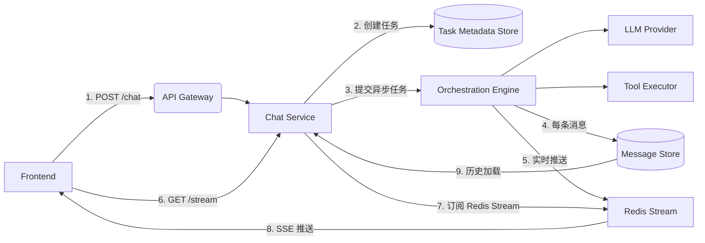

[toc]


---

# 技术方案：大模型对话系统端到端流程设计  
**版本**：1.0  
**适用场景**：AI 聊天机器人、智能客服、Copilot 类产品  

---

## 一、目标

构建一个**高可用、低延迟、支持多模态消息、断点续读、服务无感升级**的对话系统，确保用户在任何网络或设备环境下都能获得连续、一致、安全的交互体验。

---

## 二、核心特性

| 特性           | 说明                                               |
| -------------- | -------------------------------------------------- |
| ✅ 多模态消息   | 支持文本、图片、文件、网页引用、代码块、引用消息等 |
| ✅ 流式生成     | 用户提问后，实时逐段接收回复（SSE）                |
| ✅ 断点续传     | 网络中断/页面刷新后，自动从最后一条消息继续接收    |
| ✅ 服务无感升级 | 后台滚动更新、扩容、重启，用户无感知               |
| ✅ 多端同步     | Web / iOS / Android 共享同一对话状态               |
| ✅ 安全可控     | 消息鉴权、敏感信息过滤、记忆功能可开关             |

---

## 三、整体架构



> **关键解耦**：HTTP 请求 ≠ 生成过程；生成结果 → Redis Stream + DB 双写。

---

## 四、核心组件与职责

| 组件                           | 职责                                                         |
| ------------------------------ | ------------------------------------------------------------ |
| **Frontend**                   | 发起对话、自动重连 SSE、携带 `lastMessageId`、渲染多模态消息 |
| **API Gateway**                | 鉴权、限流、路由                                             |
| **Chat Service**               | 接收请求、创建任务、订阅 Redis Stream、返回 SSE              |
| **Orchestration Engine**       | 编排 LLM + 工具调用、流式生成、消息结构化                    |
| **Redis Stream**               | 实时消息队列，支持从任意 ID 续读                             |
| **Message Store (PostgreSQL)** | 永久存储完整聊天记录                                         |
| **Task Metadata Store**        | 记录任务状态（running/completed）、有效期                    |

---

## 五、端到端对话流程

### 5.1 用户发起新对话

```http
POST /api/chat
Content-Type: application/json

{
  "messages": [
    {
      "role": "user",
      "type": "TEXT",
      "content": { "text": "帮我写一篇关于AI的短文" }
    }
  ]
}
```

**服务端处理**：
1. 生成唯一 `conversation_id`（如 `conv_abc123`）；
2. 创建任务元数据（状态 = `PENDING`）；
3. 异步提交生成任务（不阻塞 HTTP）；
4. 立即返回 `202 Accepted` + `X-Conversation-ID: conv_abc123`。

### 5.2 后台生成流程（异步）

- **Redis Stream 中存的是“原始流式片段”（token 或 chunk 级别）**，用于实时推送和续传；
- **数据库（DB）中存的是“语义完整的消息”（message 级别）**，而不是简单合并的流；
- **两者不是“同一数据的不同形式”，而是“不同抽象层级”的产物。

### 1. Redis Stream：存**流式中间态**（用于实时性）

- **粒度**：可以是 token、句子、段落，取决于前端渲染需求；
- **目的**：低延迟推送 + 断点续传；
- **生命周期短**（如 1 小时）；
- **可丢失**（极端情况下降级到 DB 重建）。

```
1# Redis Stream 示例
2XADD chat:output:conv_123 * 
3  type TEXT 
4  chunk "人工智能"
5  is_final false
6
7XADD chat:output:conv_123 * 
8  type TEXT 
9  chunk "正在改变世界。"
10  is_final true   # 标记这条是完整消息的结束
```

> 💡 实际中，为了减少事件数量，通常按**句子或段落**推送，而非单个 token。

### 2. PostgreSQL：存**完整语义消息**（用于持久化）

- **粒度**：一条用户可见的“消息”（message）；
- **内容**：是流式片段**拼接后形成的完整语义单元**；
- **包含元信息**：type、role、引用关系、可见性等；
- **永久存储**，支持查询、审计、多端同步。

```
1INSERT INTO messages (id, conversation_id, role, type, content, visible)
2VALUES (
3  'msg_123',
4  'conv_123',
5  'assistant',
6  'TEXT',
7  '{"text": "人工智能正在改变世界。"}',
8  true
9);
```

> ✅ 用户在历史记录中看到的是这一整条，而不是碎片。

## 三、如何协调两者？—— 后台聚合机制

关键：**不要让 DB 写入阻塞流式输出**，也不要让前端依赖 DB 实时性。

### 推荐流程：

```
1Flux<String> llmStream = llmClient.stream(prompt);
2
3// 1. 用于前端实时显示的流（按句子切分）
4Flux<Chunk> displayStream = llmStream
5    .bufferUntil(chunk -> chunk.endsWith("。") || chunk.endsWith("\n")) // 按句切分
6    .map(chunks -> String.join("", chunks))
7    .map(text -> new Chunk(text, false));
8
9// 2. 最终完整消息（等流结束）
10Mono<String> fullMessage = llmStream.collect(String::new, String::concat);
11
12// 3. 同时做两件事：
13return Flux.merge(
14    // (A) 实时推送片段到 Redis（供 SSE 消费）
15    displayStream.doOnNext(chunk -> {
16        redisStream.publish(convId, new StreamEvent(chunk.text(), false));
17    }),
18    
19    // (B) 流结束后，写入完整消息到 DB
20    fullMessage.delayElement(Duration.ZERO).flatMap(msg -> {
21        ChatMessage completeMsg = new ChatMessage("TEXT", msg);
22        messageRepo.save(completeMsg); // 异步写 DB
23        redisStream.publish(convId, new StreamEvent(msg, true)); // 可选：发一个 final 事件
24        return Mono.empty();
25    }).then(Mono.never()) // 不产生额外元素
26);
```

> 🔑 **要点**：
>
> - 前端从 Redis Stream 拿“片段”做流式渲染；
> - DB 只存“最终完整消息”；
> - 即使服务崩溃，只要 Redis 在，用户仍能看片段；恢复后可通过日志或补偿任务补全 DB。

### 5.3 前端订阅消息流（SSE）

```http
GET /api/stream/conv_abc123?fromMessageId=msg_100
Accept: text/event-stream
```

**服务端处理**：
1. 验证用户是否有权访问 `conv_abc123`；
2. 从 Redis Stream `chat:output:conv_abc123` 的 `msg_100` 之后开始消费；
3. 将每条消息包装为 SSE 事件推送：

```sse
event: TEXT
id: msg_101
data: {"text":"人工智能正在改变世界..."}

event: IMAGE
id: msg_102
data: {"url":"https://cdn.example.com/ai.jpg","alt":"AI示意图"}
```

### 5.4 断点续传机制

- 前端监听 SSE `onerror` 或 `onclose`；
- 自动重连，携带最后收到的 `msgId`；
- 服务端从 Redis Stream 对应位置继续推送；
- **用户无感知，内容连续不重复**。

## 四、断点续传时如何处理？

当用户重连并携带 `lastMessageId=msg_122`：

1. **先查 DB**：确认 `msg_122` 是否已完整写入；
2. **再查 Redis Stream**：从 `msg_122` 之后消费所有事件；
3. **如果发现 Redis 中有未合并的片段**：
   - 前端继续流式渲染这些片段；
   - 后台异步将它们聚合成完整消息写入 DB（幂等处理）。

> 🌟 这样既保证了**实时体验**，又保证了**数据完整性**。

---

## 六、多模态消息支持

### 消息类型定义

| 类型            | content 结构                                         | 说明                           |
| --------------- | ---------------------------------------------------- | ------------------------------ |
| `TEXT`          | `{ "text": "..." }`                                  | 普通文本                       |
| `IMAGE`         | `{ "url": "...", "alt": "..." }`                     | 图片（上传或生成）             |
| `FILE`          | `{ "name": "...", "size": N, "fileId": "..." }`      | 任意文件                       |
| `WEB_REFERENCE` | `{ "url": "...", "title": "...", "snippet": "..." }` | 网页卡片                       |
| `QUOTE`         | `{ "quotedMessageId": "msg_xxx", "text": "..." }`    | 引用历史消息                   |
| `TOOL_CALL`     | `{ "tool": "search", "args": {...} }`                | 内部使用，通常 `visible=false` |

> 所有消息统一存入 `messages` 表，前端按 `type` 渲染不同组件。

---

## 七、服务高可用设计

### 7.1 无状态服务
- Chat Service 不保存任何会话状态；
- 任意实例可处理任意请求；
- K8s 水平扩缩容无压力。

### 7.2 状态外置
- **实时状态** → Redis Stream（AOF 持久化）；
- **持久状态** → PostgreSQL；
- 服务重启后，新实例直接读取外部状态。

### 7.3 优雅终止（Graceful Shutdown）
- Pod 收到 SIGTERM 后：
  - 停止接收新请求；
  - 等待现有 SSE 连接处理完（或超时）；
  - 后台生成任务继续运行（因异步提交）。

### 7.4 效果
> **滚动升级期间，用户仅经历短暂重连（<1s），内容完全连续。**

---

## 八、数据存储策略

| 数据       | 存储         | TTL                  | 用途                 |
| ---------- | ------------ | -------------------- | -------------------- |
| 聊天记录   | PostgreSQL   | 永久（或按策略归档） | 历史查询、审计       |
| 实时消息流 | Redis Stream | 1 小时               | SSE 续读、低延迟推送 |
| 任务元数据 | PostgreSQL   | 1 小时（自动清理）   | 任务状态管理         |
| 媒体文件   | OSS/S3       | 永久（或按需）       | 图片/文件存储        |

---

## 九、安全与隐私

- 所有 API 接口校验 `user_id` 与 `conversation_id` 权限；
- 文件下载接口 `/files/{fileId}` 需鉴权；
- 敏感信息（身份证、银行卡）在消息入库前过滤；
- 聊天记忆功能默认关闭，用户可手动开启。

---

## 十、监控与运维

| 指标              | 说明                                |
| ----------------- | ----------------------------------- |
| 任务完成率        | 成功 / 总任务数（目标 >99%）        |
| 续传成功率        | 重连后成功恢复的比例（目标 >99.5%） |
| Redis Stream Lag  | 消费延迟（应 <1s）                  |
| LLM 调用 P95 延迟 | <2s                                 |
| DB 写入 QPS       | 监控瓶颈                            |

---

## 十一、总结

本方案通过以下设计实现工业级对话体验：

1. **生成与连接解耦** → 支持服务无感升级；
2. **Redis Stream + DB 双写** → 保证实时性与持久性；
3. **前端自动重连 + 断点 ID** → 实现无缝续读；
4. **统一消息模型** → 支持无限扩展的消息类型；
5. **异步任务 + 状态外置** → 高可用、易扩展。

> ✅ 最终效果：  
> - 用户锁屏 10 分钟回来 → 自动续传；  
> - 服务滚动更新 → 无感知；  
> - 发图片、传文件、引用历史 → 全支持；  
> - 对话记录永久可查。

---


```sql
-- 生成chunk 合并5个 返回一次 ，默认通过当前流返回数据 记录redis  XADD  KEY  *  field value    返回消息id   key为messageId
- 断点续读 前端缓存已经读取的 消息列表，调用接口将最后一条消息id 传入， 调用redis 是否存在， 循环：存在分页获取一次获取10个消息数据，直到把所有的消息数据都读完退出。

```