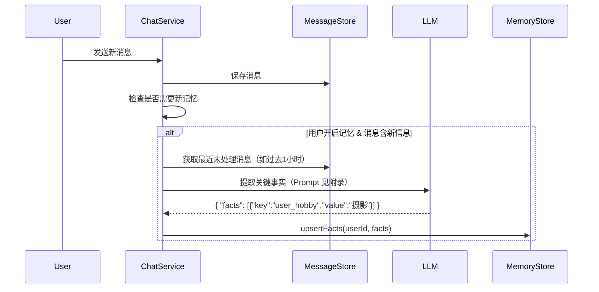

[toc]


# 技术方案二：聊天记忆系统（Chat Memory System）

## 1. 目标

构建一个**智能、动态、用户可控**的上下文记忆系统，使大模型在长对话中能精准利用历史信息，同时避免 token 浪费与隐私泄露。

## 2. 核心理念

> **“用户看到完整历史，模型只用精华上下文”**

- 聊天记忆 ≠ 聊天记录；
- 记忆是**为 LLM 推理服务的精简上下文**；
- 支持用户开启/关闭、查看、删除记忆。

## 3. 记忆分层架构

| 层级           | 内容                                        | 生命周期  | 更新方式      |
| -------------- | ------------------------------------------- | --------- | ------------- |
| **短期记忆**   | 最近 3~10 条消息（动态调整至 ≤3000 tokens） | 请求级    | 实时查询 DB   |
| **长期记忆**   | 从历史中提取的关键事实（Key-Value）         | 天级/周级 | 异步 LLM 摘要 |
| **任务上下文** | 当前会话的临时状态（如上传文件主题）        | 会话级    | 实时注入      |

## 4. 数据模型

### 4.1 记忆事实表（memory_facts）
| 字段             | 类型        | 说明                       |
| ---------------- | ----------- | -------------------------- |
| `user_id`        | TEXT        | 用户ID                     |
| `key`            | TEXT        | 记忆键，如 `user_location` |
| `value`          | TEXT        | 记忆值，如 `"北京市"`      |
| `source_msg_ids` | TEXT[]      | 来源消息ID列表（用于溯源） |
| `confidence`     | FLOAT       | 置信度（0~1，LLM 输出）    |
| `created_at`     | TIMESTAMPTZ | 首次提取时间               |
| `updated_at`     | TIMESTAMPTZ | 最后更新时间               |

### 4.2 用户记忆配置（user_memory_settings）
| 字段           | 类型    | 说明             |
| -------------- | ------- | ---------------- |
| `user_id`      | TEXT    | 用户ID           |
| `enabled`      | BOOLEAN | 是否启用记忆功能 |
| `auto_extract` | BOOLEAN | 是否自动提取事实 |

## 5. 记忆生成流程



## 6. 上下文构造（每次 LLM 调用前）

```java
public List<LLMMessage> buildContext(String convId) {
    // 1. 短期记忆：最近消息（不超过 3000 tokens）
    List<Message> shortTerm = messageRepo.findLatestWithinTokenLimit(convId, 3000);

    // 2. 长期记忆：用户关键事实
    List<MemoryFact> longTerm = memoryRepo.findByUser(userId);
    String memorySummary = longTerm.stream()
        .map(f -> f.getKey() + ": " + f.getValue())
        .collect(Collectors.joining("\n"));

    // 3. 构造系统消息（注入记忆）
    LLMMessage systemMsg = new LLMMessage("system",
        "【用户记忆】\n" + memorySummary +
        "\n\n请基于以上信息和近期对话回答问题。"
    );

    return Stream.concat(
        Stream.of(systemMsg),
        shortTerm.stream().map(this::toLLMMessage)
    ).toList();
}
```

## 7. 用户控制能力

- **前端提供“记忆管理”入口**：
  - 开关：启用/禁用记忆功能；
  - 查看：列出所有记忆项（带来源消息链接）；
  - 删除：单条或全部清除；
- **隐私保护**：
  - 敏感词过滤（身份证、手机号等）不进入记忆；
  - 记忆数据加密存储；
  - GDPR 合规：支持数据导出与彻底删除。

## 8. 性能与成本优化

- LLM 提取事实采用**低频异步**（消息产生后延迟 1~5 分钟处理）；
- 设置每日记忆提取配额（防滥用）；
- 长期记忆定期合并/去重（如相同 key 取最新 value）；
- 短期记忆使用 Redis 缓存（减少 DB 查询）。

## 9. 附录：LLM 提取事实 Prompt 示例

```text
你是一个信息提取助手。请从以下对话中提取用户明确陈述的、稳定的个人信息或偏好，以 JSON 格式输出。

要求：
- 只提取确定的事实，不确定的不要输出；
- key 使用 snake_case；
- 忽略临时性内容（如“今天天气不错”）；
- 不要包含任何解释。

对话：
User: 我住在北京，喜欢吃川菜。
Assistant: 好的！北京有很多不错的川菜馆。
User: 对了，我叫李明。

输出：
{
  "user_name": "李明",
  "user_location": "北京",
  "food_preference": "川菜"
}
```

---

## 总结对比

| 维度           | 聊天记录                        | 聊天记忆               |
| -------------- | ------------------------------- | ---------------------- |
| **目的**       | 用户回溯历史                    | 模型理解上下文         |
| **完整性**     | 完整原始数据                    | 精简摘要/事实          |
| **可见性**     | 用户可见                        | 用户可选可见           |
| **存储**       | PostgreSQL（主）+ Redis（缓存） | PostgreSQL（facts 表） |
| **更新频率**   | 实时                            | 异步（分钟级）         |
| **隐私敏感度** | 高（需加密）                    | 极高（需过滤+授权）    |

这两套系统协同工作，共同支撑起豆包这类产品“既聪明又可靠”的对话体验。

如需 Word/PDF 版、数据库 DDL 脚本、或 Spring Boot 代码模板，可继续告知！